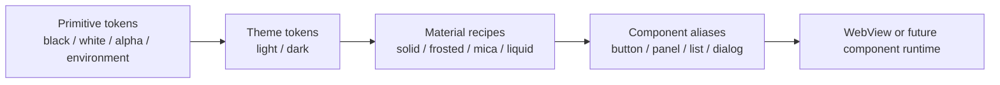

# CHUZI Design Language

**规范版本：** 1.0 design baseline
**状态：** 设计规范与 `launcher-ui` 首份实现已同步
**适用范围：** Web UI、Rust/Wry Desktop App、共享 Component System、Light/Dark Theme 与四种 Material
**当前实现落点：** `launcher-ui` 的 Rust/Wry 原生壳与内嵌 vanilla HTML/CSS/JS 页面

本文定义 CHUZI 的视觉语言和实现契约。它只描述视觉系统、组件所需的设计属性和无障碍规则，不定义信息架构、页面流程或具体页面布局。后续实现可以使用 CSS custom properties、Web Components、其他 Web 框架或原生桥接，但必须保持本文的 token 语义和 Theme × Material 组合关系。

文中使用以下规范词：

- **MUST / 必须**：实现不可违反的契约。
- **SHOULD / 应该**：默认行为；有证据的产品或平台约束才可偏离。
- **MAY / 可以**：可选增强，不影响基线行为。

## 1. Design Language Overview

CHUZI 是一个面向本地运行时、账号会话和受控操作的 control desk。它的界面应该让人先看见内容和状态，再感知材质。视觉系统的两个维度正交；CHUZI 主动绘制的 authored layer 只使用黑、白和由黑/白 alpha 合成出的灰阶，最终 composite 可以在透明材质中显示环境本来的颜色：

```text
CHUZI DESIGN LANGUAGE

Theme                         Material
├── Light                     ├── Solid
└── Dark                      ├── Frosted Glass
                              ├── Mica
                              └── Liquid Glass

                 Theme × Material = one resolved surface recipe
```

Theme 决定黑白明度、文字对比度和前景/背景关系；Material 决定 surface 如何处理环境、透明度、模糊、明度、边缘光和层次。任何组件先选择语义 surface role，再解析 Theme 和 Material。组件不直接声明“玻璃卡片”或一组自创阴影。

### 1.1 What makes a CHUZI interface look like CHUZI?

CHUZI 的辨识度来自以下组合，而不是某一个圆角或渐变：

1. **Monochrome control-desk tone**：只使用黑与白，以及黑/白 alpha 合成出的灰阶承载内容。界面安静、明亮或低眩光，不依赖色相制造品牌感。
2. **A quiet luminance signal**：CHUZI 用明度、边界、图标、文字和结构表达行动与状态；没有任何由 CHUZI 主动绘制的色相，也不使用发光代替状态文本。
3. **Tonal hierarchy before decoration**：canvas、surface、elevated surface 通过明度和细线区分，层级先于阴影，阴影先于光学效果。
4. **Two-axis consistency**：同一个组件在八种组合中仍使用相同的语义角色、尺寸、文字和交互状态；只改变环境关系和 surface recipe。
5. **Content-first density**：信息密集区域保持紧凑但不拥挤，留白按 4 px 节奏组织；材质不改变内容的布局、阅读顺序或命中区域。
6. **Restrained optical depth**：Frosted、Mica、Liquid 的效果都有限幅、有降级、有对比度验证。用户永远能在 Solid fallback 中完成同一操作。
7. **Platform respect without imitation**：Apple 提供 light/dark、vibrancy 和 fluid translucency 的参考，Windows 提供环境色调和 Mica 的参考；CHUZI 用自己的黑白明度、间距、状态语言和组件契约重新组织这些材料。

如果移除所有 blur、shadow、transmission 和 highlight，页面仍应因为黑白 authored layer、排版、间距和状态表达而看起来像 CHUZI。这是验收 Material 的第一条原则。

### 1.2 Scope and technical assumptions

当前仓库不是 React 应用。`launcher-ui` 由 Rust/Wry 承载一个内嵌页面，页面使用 vanilla HTML/CSS/JS，调用 `chuzi.launcher-ui/v1` IPC；桌面运行时分别使用 WebView2、WKWebView 或 WebKitGTK。设计 token 因此必须满足：

- **静态可打包**：基础 token 不依赖远程字体、远程图片、网络 CSS 或运行时下载。
- **渐进增强**：backdrop blur、environment sampling、blend 和可选 distortion 都是增强；不支持时保持可读的 Solid 或 Mica-like surface。
- **跨 WebView 可预测**：以标准 CSS color、opacity、border、box-shadow、media query 为基线；对浏览器差异使用能力检测，不使用平台名称猜测。
- **桥接隔离**：Theme/Material 是 UI 本地状态。它们不进入 Go launcher 的安装、更新、插件信任或服务控制协议，除非将来另立协议版本。
- **可测试**：token 解析、fallback、状态对比度和 `prefers-reduced-motion` 行为可以在无图形环境的 Node harness 中验证；视觉回归在支持的 WebView/Chromium 中补充验证。

### 1.3 Platform rendering boundary

同一套 token 在普通浏览器和桌面 WebView 中解析；宿主能力只决定 Material 是否增强，不决定组件语义。

| Runtime | 共享内容 | 平台边界 |
| --- | --- | --- |
| 普通 Web UI | semantic black/white tokens、type、spacing、radius、interaction、Solid/Mica fallback | 不假设系统 backdrop、原生 titlebar 或窗口级环境；背景由文档自身提供。 |
| Windows Wry/WebView2 | 上述全部，加上可选 backdrop enhancement | WebView2 runtime、窗口标题栏和高对比度由宿主/系统管理；页面不能把 WebView2 专有 API 当作 token 来源。 |
| macOS Wry/WKWebView | 上述全部，加上可选 backdrop enhancement | 尊重系统 appearance、safe area 和 Reduce Transparency；页面不复制 AppKit 控件的私有外观。 |
| Linux Wry/WebKitGTK | 上述全部，加上能力检测后的 enhancement | X11/Wayland 会话和 WebKitGTK 能力可能不同；缺少 blur 时必须稳定退回 Solid/Mica。 |

Web 内容不应把页面绘制到原生 titlebar 或依赖窗口背后的像素，除非宿主明确提供并测试了该 capability。窗口控制按钮、系统菜单和可访问名称属于宿主/平台职责；页面中的通用控件仍遵循本文 token。Scrollbar、selection 和 focus 等 UA 细节可以采用平台默认，但关键状态必须有 CHUZI semantic fallback。

#### 1.3.1 Current-stack capability map

当前 `launcher-ui` 以 Rust/Wry 创建普通不透明窗口，再通过 `load_html` 加载内嵌 vanilla HTML/CSS/JS。规范落地时应沿这条能力链增强：

| Layer | 当前技术栈的基线 | 可选增强 | 失败行为 |
| --- | --- | --- | --- |
| Theme/tokens | CSS custom properties + `data-theme`/`data-material` | 生成静态 token 文件 | 保留 Light + Solid |
| Solid | 标准 CSS fill、border、shadow | 无 | 始终可用 |
| Mica | 近似不透明 CSS surface + 页面低频环境 tone | 宿主以后提供 environment tint | 保持黑白 Solid-like tone |
| Frosted | `backdrop-filter` / `-webkit-backdrop-filter` 能力检测 | transparent host backdrop | 提高 alpha，解析为 Mica/Solid |
| Liquid body | CSS layered surface、mask、pseudo-element | composited page environment | 解析为 Frosted/Mica |
| Refraction/dispersion | 当前不作为基线承诺 | 经验证的 SVG filter、Canvas/WebGL 或宿主 compositor path | 关闭通道，不用预设彩虹图层替代 |

能力检测应由 CSS/JS resolver 和可选宿主 capability payload 共同完成。当前 `chuzi.launcher-ui/v1` 没有外观或 compositor capability 字段，因此第一阶段只可使用 `page`/`none` environment；若以后需要真实桌面透射，应另立宿主 UI capability boundary，而不是把外观数据塞进现有业务请求。

### 1.4 Environment and authored-color boundary

CHUZI 的 authored UI 只写入黑、白和 alpha。Material 可以显示环境本来就有的颜色，但这些颜色必须来自合成链，而不是来自 CHUZI 的 palette：

```text
authored layer       = #000 / #fff + alpha
environment layer    = viewport / host backdrop / desktop compositor
material transform   = transmission + diffusion + (optional) refraction
visible result       = authored layer ⊕ transformed environment
```

环境颜色的规则：

- Web UI 默认只提供黑白页面环境；只有外部内容确实带有图片或渐变时，才将其标记为 `page` environment input，而不是 CHUZI authored palette。页面不能读取用户桌面像素。
- Desktop WebView 只有在宿主明确提供透明窗口和低频 backdrop capability 时，才可以透出窗口后面的桌面颜色；不能用屏幕截图、隐式录屏或未授权的桌面采集模拟它。
- Mica 可以采样环境的低频平均明度/色调，但 surface 本身仍保持近似不透明；Frosted 可以透过被扩散的环境；Liquid 还可以在边缘做受限折射和色散。
- 环境颜色只能影响 surface/environment/highlight，不能改变正文、状态语义、focus、图标或 action 的黑白 token。
- 没有环境源时，Material 必须用黑白 synthetic environment 继续工作；用户不应看到空白、未合成的透明层或“假彩色”占位。

因此“黑白 Design Language”与“透明材质透出桌面颜色”并不矛盾：前者约束 CHUZI 主动绘制的颜色，后者描述物理合成后可能看到的外部环境。实现文档、截图回归和 token 文件必须分别标记 `authoredColor` 与 `environmentColor`，不能把环境采样保存成品牌色或状态色。

#### 1.4.1 Environment source contract

环境源必须显式声明，不从操作系统名称推断：

| Source | 可见内容 | 必要条件 | 不允许的替代方式 |
| --- | --- | --- | --- |
| `page` | 当前页面自己的背景或资源 | 普通 Web UI 即可 | 读取屏幕或桌面像素 |
| `host-backdrop` | 宿主提供的窗口后方低频 backdrop | 宿主 API、权限和生命周期契约 | 隐式截图、录屏、轮询屏幕 |
| `desktop-compositor` | 桌面 compositor 的真实透射 | 透明窗口、合成器支持、性能预算 | 用预设品牌色假装桌面颜色 |
| `none` | 无环境，使用黑白 synthetic environment | 默认安全路径 | 留下未合成的透明洞 |

环境采样只保留渲染所需的短生命周期数据，不进入业务状态、日志、持久化主题 token 或 IPC。采样应先做低频化和边缘保护，再与 authored layer 合成；窗口移动、失焦、遮挡和显示器切换时，允许在 `220 ms` 内平滑更新，但不得让正文颜色跟随桌面闪动。当前 Rust/Wry launcher 默认使用不透明窗口，因此默认 `environmentSource=page`；只有未来宿主明确实现透明窗口 capability，才可选择 `host-backdrop` 或 `desktop-compositor`。

### 1.5 Surface roles

所有组件先选一个 surface role。role 描述“它在层级中是什么”，Material 描述“它怎样呈现”。推荐 role 如下：

| Role | 语义 | 默认层级 | 典型内容 |
| --- | --- | ---: | --- |
| `canvas` | 应用最底层环境 | 0 | 页面背景、窗口空白区 |
| `chrome` | 稳定的窗口/导航区域 | 1 | 顶栏、侧栏、工具栏 |
| `primary` | 主要内容容器 | 1 | 面板、列表、表单区 |
| `secondary` | primary 内的次级分组 | 2 | 分组、辅助信息、内嵌状态 |
| `elevated` | 暂时脱离文档流的内容 | 3 | 菜单、浮层、日期选择器 |
| `interactive` | 可操作控件的面 | 2 | button、select、segmented control |
| `selected` | 当前选择或焦点上下文 | 2 | 选中行、当前导航项 |
| `scrim` | 遮挡背景、保护对比度 | 4 | modal 背景、复杂图片上的文字底 |
| `disabled` | 禁用但仍可见的区域 | 同父级 | disabled control、不可用列表项 |

Material 只能改变 role 的呈现配方，不能借此改变 role 的语义层级。一个组件最多嵌套两层半透明 surface；第三层必须改为不透明或提高 alpha。

## 2. Theme System

Theme 是全局语义环境，只有 `light` 和 `dark` 两个 canonical values。产品可以提供 `system` 偏好，但 `system` 只负责解析为 light 或 dark，不产生第三套颜色。

Theme resolver 的顺序应为：

1. 用户明确保存的 `light`/`dark` 偏好；
2. 可选的 `system` 偏好对应的 `prefers-color-scheme`；
3. `light` 作为稳定默认值。

首次绘制时应直接使用解析后的主题，避免先绘制 Light 再闪到 Dark。用户手动切换主题时可以用 160–220 ms 的颜色过渡；过渡不应阻塞操作，也不应把 Material 的模糊半径做成持续动画。

Theme 必须同时提供以下语义关系：

```text
background → surface → elevated surface → interactive surface
foreground.primary → foreground.secondary → foreground.tertiary → disabled
action → action.hover → action.pressed → action.quiet
border.subtle → border.default → border.strong → focus
```

这些关系在两种主题中独立定义，不能把 Light 的 RGB 值简单反转得到 Dark。

## 3. Light Theme

Light Theme 参考 Apple Light Appearance 的清洁、明亮和克制感。它是白色环境上由黑色 alpha 生成的连续灰阶；不使用色相、彩色阴影或彩色状态。

### 3.1 Light principles

- canvas 使用 `#fff`；所有灰阶来自黑色 alpha 叠加，大面积纯白可以作为稳定环境。
- primary/secondary surface 的明度差小而连续，边界用 1 px 的黑色 alpha border 辅助，不用粗框。
- 主文字使用 `#000`，secondary/tertiary 只使用黑色 alpha；普通正文目标至少 4.5:1。
- action 使用黑色填充配白色文字，或白色填充配黑色文字；action quiet 只通过明度和结构表达，不引入色相。
- 阴影只由黑色 alpha 构成；如果阴影被关闭，黑白 surface tone 和 border 仍保持层级。
- Frosted/Liquid 的透明度不能让白色环境冲淡前景文字；需要时先提高 surface alpha，再减少 blur。

### 3.2 Light surface ladder

| Role | Light baseline | 视觉目的 |
| --- | --- | --- |
| `canvas` | `#fff` | 低刺激的全局底色 |
| `canvas.subtle` | `rgba(0,0,0,.04)` over `#fff` | 分区、滚动区域、环境色块 |
| `surface.1` | `rgba(0,0,0,.02)` over `#fff` | 普通内容面 |
| `surface.2` | `#fff` | 控件、最高可读性面 |
| `surface.3` | `rgba(0,0,0,.06)` over `#fff` | 次级分组、工具栏 |
| `surface.interactive` | `rgba(0,0,0,.10)` over `#fff` | hover/selected 的低强度填充 |
| `surface.inverse` | `#000` | 深色提示或反色 badge |

以上是 Solid 的基准色。其他 Material 以这些 role 为底色和 fallback，不另造一套不相干的白色。

### 3.3 Light foreground and border

| Token role | Baseline | 使用 |
| --- | --- | --- |
| `fg.primary` | `#000` | 标题、正文、关键数值 |
| `fg.secondary` | `rgba(0,0,0,.68)` | 辅助说明、元数据 |
| `fg.tertiary` | `rgba(0,0,0,.52)` | 次级标签、占位提示；不得用于唯一的错误/成功说明 |
| `fg.disabled` | `rgba(0,0,0,.38)` + 明确 disabled 状态 | 禁用内容；不可作为唯一信息来源 |
| `fg.on-action` | `#fff` | 黑色 action 填充上的文字 |
| `border.subtle` | `rgba(0,0,0,.10)` | 装饰性分隔、低层级边界 |
| `border.default` | `rgba(0,0,0,.18)` | 面板、输入框、列表行边界 |
| `border.strong` | `rgba(0,0,0,.42)` | 可操作控件、悬停、可见分区 |
| `focus` | `#000` | 2 px 外环，不能只依靠颜色变化 |

## 4. Dark Theme

Dark Theme 参考 Apple Dark Appearance 的低眩光和分层表面。它以 `#000` 为环境，用白色 alpha 构成逐级升高的 surface luminance；不使用彩色暗底或彩色高光。

### 4.1 Dark principles

- `canvas` 的基准为 `#000`，深层 scrim 仍为黑色；所有可见层级由白色 alpha 提亮，不引入彩色暗底。
- elevation 通常通过轻微增加 surface luminance、白色 alpha border 和局部透明度表达；不靠强烈黑色阴影。
- primary/secondary/elevated 的明度差必须可感知，但不能形成一组发光的矩形。
- 主文字使用 `#fff`；secondary/tertiary 使用白色 alpha，避免纯白大面积造成刺眼。
- action 在暗底上使用白色填充配黑色文字，或黑色填充配白色文字；不用发光色相制造 signal。
- 透明 Material 默认比 Light 更密实；背景细节不能穿过文字区形成高频噪声。

### 4.2 Dark surface ladder

| Role | Dark baseline | 视觉目的 |
| --- | --- | --- |
| `canvas` | `#000` | 低眩光应用环境 |
| `canvas.subtle` | `rgba(255,255,255,.04)` over `#000` | scrim、深层背景 |
| `surface.1` | `rgba(255,255,255,.06)` over `#000` | 普通内容面 |
| `surface.2` | `rgba(255,255,255,.10)` over `#000` | 控件、突出内容 |
| `surface.3` | `rgba(255,255,255,.14)` over `#000` | 次级分组、hover |
| `surface.interactive` | `rgba(255,255,255,.18)` over `#000` | 选中/hover 的暗色调面 |
| `surface.inverse` | `#fff` | 反色 badge 或高亮文字面 |

Dark elevation 不能把 surface 推向纯白；任何比 `surface.2` 更亮的区域必须有明确的交互或焦点理由。

### 4.3 Dark foreground and border

| Token role | Baseline | 使用 |
| --- | --- | --- |
| `fg.primary` | `#fff` | 标题、正文、关键数值 |
| `fg.secondary` | `rgba(255,255,255,.72)` | 辅助说明、元数据 |
| `fg.tertiary` | `rgba(255,255,255,.56)` | 次级标签、提示 |
| `fg.disabled` | `rgba(255,255,255,.38)` + disabled 语义 | 禁用内容；不承载唯一信息 |
| `fg.on-action` | `#000` | 白色 action 填充上的文字 |
| `border.subtle` | `rgba(255,255,255,.14)` | 装饰性分隔 |
| `border.default` | `rgba(255,255,255,.22)` | 面板、输入框、列表行边界 |
| `border.strong` | `rgba(255,255,255,.48)` | 可操作控件、悬停、分区 |
| `focus` | `#fff` | 2 px 外环；必要时再加 1 px 黑色内衬 |

## 5. Material System

Material 是 surface 的完整系统，不是一个 CSS 特效开关。每个 Material recipe 至少包含：

```text
material
├── fill            # surface fill alpha / base tone
├── environment     # background relationship
├── opacity        # fill alpha, not content opacity
├── blur           # backdrop blur radius
├── environmentSaturation # sampled backdrop multiplier; never an authored color
├── tint           # achromatic or explicitly environment-derived contribution
├── border          # edge and separator treatment
├── shadow          # restrained depth cue
├── highlight      # top/edge optical cue
├── elevation      # semantic layer mapping
├── contrast       # composited foreground guarantee
└── interaction    # hover/pressed/focus/disabled behavior
```

### 5.1 Shared material rules

1. **Opacity 指 surface fill alpha**。不得把整个元素的 `opacity` 用作 Material，否则文字、图标和命中区域会一起变淡。
2. **先算语义底色，再叠加环境**。环境贡献、tint 和 highlight 都有上限；不能让背景图片或渐变决定文字对比度。
3. **Blur 是背景处理，不是内容处理**。内容所在层不使用 `filter: blur`；只有 backdrop 可模糊。
4. **Material 不改变 geometry**。圆角、间距、尺寸、滚动和焦点顺序由组件 token 决定。
5. **透明层应少而稳定**。同一视图最多一个主要环境层和一个 transient overlay 层；半透明层彼此叠加时提高 alpha 或转为 Solid。
6. **边缘不发光**。highlight 是低 alpha 的环境反射线，不是彩色 neon border。
7. **Material 可退化**。能力缺失、对比度不足、系统高对比度或用户关闭透明效果时，按明确 fallback 链执行。
8. **内容优先**。如果 Material 与文本、表格、状态徽标产生竞争，降低 opacity/blur/environment exposure，直到 hierarchy 恢复。

### 5.2 Material capability and fallback

实现层应以能力检测解析 material，而不是以操作系统名称硬编码：

```text
Liquid Glass → Frosted Glass → Mica → Solid
Frosted Glass → Mica → Solid
Mica → Solid + environment-derived solid tint
Solid → Solid
```

用户选择的 Material 名称可以保留在偏好中，但实际渲染状态应能报告 `resolvedMaterial`（例如 `liquid` 请求在不支持 backdrop 时解析为 `solid`）。失败时不得显示空白、低对比度文字或半成品光效。

### 5.3 Shared material ranges

Material 有两个互不混用的颜色平面：

- **Authored plane** 是 CHUZI 绘制的 layer，只能由 `#000`、`#fff` 和 alpha 组成，`authoredChroma = 0`。
- **Environment plane** 是页面背景、宿主 backdrop 或桌面 compositor 提供的采样。它可以保留自然色相，但不能写回 token、状态或品牌 palette。

表中的 `environmentSaturation` 只作用于 Environment plane。`100%` 表示保持采样值，不表示 CHUZI 主动绘制颜色；任何高于 `100%` 的放大都禁止。范围是 surface role 的默认起点，组件只能在范围内微调。

| Material | Fill alpha（Light / Dark） | Backdrop blur | Authored chroma | Environment sampling | `environmentSaturation` | Typical transmission |
| --- | ---: | ---: | ---: | --- | ---: | ---: |
| Solid | `1.00 / 1.00` | `0 px` | `0` | none | `0%` | `0%` |
| Frosted Glass | `0.72–0.86 / 0.68–0.82` | `16–24 px` | `0` | local/backdrop，扩散细节 | `85–100%` | `14–28%` |
| Mica | `0.88–0.96 / 0.80–0.92` | `20–32 px` | `0` | 低频平均明度与环境色调 | `55–85%` | `4–12%` |
| Liquid Glass | `0.60–0.82 / 0.62–0.84` | `24–36 px` | `0` | body 透射，edge 可折射 | `85–100%` | body `18–40%`；edge `≤55%` |

合成可用以下抽象模型描述：

```text
E       = environment source (page / host / compositor)
E'      = diffuse(E, blur) × environmentSaturation
S       = achromatic theme surface for the role
T(x)    = bounded transmission mask at pixel x
C(x)    = (1 - T(x)) × S + T(x) × E'(x)
```

`T` 是 surface 的环境贡献，不是整个元素的 CSS `opacity`；文字、图标、focus ring 和命中区域始终位于独立的高对比度 content well。`tint`、`highlight` 和 `reflection` 只能是黑白 authored layer，或明确标记为 `environment-derived` 的采样结果。

### 5.4 Material Motion Contract

材质交互不是“给卡片加 hover 动画”。它是由输入事件驱动、受 token 限制、可以关闭的 surface response。实现任何 Material motion 前，先判断组件的语义状态，再选择允许的响应通道：

```text
state channel    = fill / border / foreground semantic state
depth channel    = tonal elevation / shadow / scrim
optical channel  = blur / environment exposure / achromatic tint / highlight / reflection
geometry channel = transform / scale / bounded parallax
```

通道有明确优先级：`state > depth > optical > geometry`。如果 state 已经足够表达 hover 或 pressed，就不应再启用 optical/geometry。Geometry 永远不改变文档流、文字基线、焦点位置或 pointer hit area。

#### 5.4.1 Shared event phases

所有可交互 surface 都使用同一组 phase 名称，Material 只改变每个 phase 的表现：

| Phase | 触发 | 结束/取消 | 基础要求 |
| --- | --- | --- | --- |
| `rest` | 无输入 | `pointerenter`、focus、键盘 activation | 完成渲染的稳定态，不等待动画 |
| `hover` | pointer/trackpad 进入 | 离开、触控取消 | 只在 hover-capable pointer 上启用；不作为唯一状态线索 |
| `focus` | `:focus-visible` | focus 离开 | 使用独立 focus ring；不被 material highlight 替代 |
| `press` | pointer down、Space/Enter 按下 | pointer up、取消、Escape | 立即给出可见反馈；不得延迟到 action 完成 |
| `selected` | 状态被选中 | 取消选择或移除 | 具有持久 semantic indicator，不使用循环动画 |
| `busy` | 请求/任务开始 | 成功、失败、取消 | 保持 label、宽度和键盘位置；进度由语义状态表达 |
| `disabled` | 组件不可用 | 恢复可用 | 不响应 pointer/keyboard；仍保持可辨认轮廓 |
| `enter` / `exit` | surface 插入/移除 | 动画结束或 reduced effects | 只用于 transient surface；不能阻塞内容读取 |

输入事件必须是幂等的。重复 `pointerenter`、窗口重绘、主题切换和 WebView 重载不能叠加 opacity、blur 或 transform。一个组件同一时刻只能处于一个 `hover/press` 视觉 phase；`focus` 可以与 `hover` 并存，但 focus ring 独立计算。

#### 5.4.2 Material response budget

每种材质有一个 optical budget，组件实现不能超出预算：

| Material | 可动通道 | 默认响应 | 单次最大时长 | 最大几何变化 | 禁止行为 |
| --- | --- | --- | ---: | ---: | --- |
| Solid | state、depth | tonal fill、border、shadow | `160 ms` | `0 px` | blur、environment sampling、持续光泽 |
| Frosted Glass | state、depth、受限 optical | alpha、environment exposure、静态 edge highlight | `220 ms` | `0 px` | 动画 blur、背景视差、闪烁反射 |
| Mica | state、depth、低频 environment tint | tonal shift、window activation tint | `220 ms` | `0 px` | pointer-following 高光、可见背景穿透 |
| Liquid Glass | state、depth、optical、受限 geometry | specular/highlight、bounded parallax、refraction cue | `320 ms` | `1 px`（拖拽 preview 可到 `2 px`） | 3D 翻转、持续反射、彩色 glow、内容缩放 |

“最大时长”是响应完成时间，不是循环时长。所有材质都禁止无限循环的 hover animation。离开、取消和失败必须有明确的静态终态，不能以光效表示网络或任务仍在运行。

#### 5.4.3 Capability and preference gates

Material motion resolver 在启用 optical/geometry 通道前检查：

```text
capabilities.backdropFilter
capabilities.compositedOpacity
capabilities.environmentSource (page | host-backdrop | desktop-compositor | none)
capabilities.transparentWindow (required for desktop backdrop)
capabilities.transform3d (Liquid only; optional)
capabilities.refraction (Liquid only; optional)
capabilities.dispersion (Liquid only; optional)
preferences.reduceMotion
preferences.reduceTransparency
preferences.increaseContrast
input.pointerType (mouse | pen | touch | keyboard)
```

- `reduceMotion`：保留 state channel，关闭 enter/exit 位移、pointer-following highlight、parallax、refraction 和 spring；颜色变化不超过 `100 ms`。
- `reduceTransparency`：Liquid/Frosted 的 optical channel 关闭，解析为 Mica/Solid；Material 选择名称可以保留，但 `resolvedMaterial` 必须反映实际渲染。
- `increaseContrast` 或 `forced-colors`：只保留 semantic state、focus 和必要的 depth；移除 alpha、environment exposure、highlight、shadow 和 geometry enhancement。
- `environmentSource=none`：禁止读取屏幕、截图或猜测桌面颜色；使用黑白 synthetic environment，并关闭 refraction/dispersion。
- `transparentWindow=false`：桌面 WebView 不得声称能透出窗口后方；只能使用页面自身背景，或退回 Mica/Solid。
- `capabilities.dispersion=false`：Liquid 保留 achromatic transmission 与静态 highlight，不用 CSS 彩虹渐变模拟色散。
- `pointerType=touch`：不模拟 hover；第一次 tap 只聚焦/选择，press feedback 使用 state channel，避免 tap 后留下 pointer highlight。
- `pointerType=keyboard`：不生成 optical response；focus ring 与 selected state 必须足够清晰。

### 5.5 Material-specific interaction recipes

以下 recipes 是组件默认行为。组件可以减少效果，但不能超过对应的 opacity、时间和几何上限。所有 `delta` 都是相对于该 surface role 的 rest 值。

#### Solid motion recipe

Solid 的交互反馈是确定性的 tonal state。它不模拟物理材质，也不响应 pointer 位置。

| Phase | state channel | depth channel | optical/geometry | Timing |
| --- | --- | --- | --- | --- |
| `hover` | fill 向 `surface.interactive` 移动 1 tonal step；border 提高到 `border.strong` | 不变 | 无 | `motion.fast` / `ease.standard` |
| `focus` | 不改 fill | 不变 | 2 px `color.focus` ring + 2 px offset | `motion.instant` |
| `press` | fill 再移动 1 step；primary action 可降低 4–6% luminance | shadow 降一级，表达按下 | 无 transform | `motion.micro` |
| `selected` | `color.action.quiet` + leading indicator/check/icon | 不变 | 无 | `motion.fast` |
| `busy` | 保持当前 fill/label | 保持当前 elevation | progress indicator 由组件提供 | 状态驱动 |
| `enter` / `exit` | 可做 opacity `0→1` / `1→0` | 不变 | 不位移，不 scale | `motion.standard` |

Solid 的验收是“输入停止后 surface 立即稳定”。不要为 Solid 加 shimmer、光带、模糊或 hover scale；它的价值是低噪声和跨 WebView 一致。

#### Frosted Glass motion recipe

Frosted 的运动表达透明介质被“压实”或“释放”，但环境本身不应随 pointer 变形。Backdrop blur 半径保持固定，避免 GPU 开销和文字抖动。

| Phase | state channel | depth channel | optical channel | Timing |
| --- | --- | --- | --- | --- |
| `hover` | fill alpha `+0.04`（上限按 material range）；border alpha `+0.04` | shadow 提升最多 1 level | environment exposure 可提高 `2–4 pp`；不提高环境饱和度；静态 top edge 保持 | `160 ms` / `ease.standard` |
| `focus` | fill 至少取 interactive 高端 | 不变 | 不使用 highlight 伪装 focus；用不透明 ring | `motion.instant` |
| `press` | fill alpha 再 `+0.06–0.10`，环境穿透减少 | shadow 降 1 level，表达 surface 被压近 | authored tint 回到 neutral，禁止反射闪烁 | `100 ms` down / `160 ms` up |
| `selected` | color.action.quiet 叠在 surface tone 上，保持正文对比度 | 不变 | 可有一次 `120 ms` 的 environment exposure settle，不能循环 | `motion.fast` |
| `busy` | 提高 content well alpha，不让 progress 穿过环境 | 不变 | backdrop blur/environmentSaturation 固定 | 状态驱动 |
| `enter` / `exit` | alpha 从 `0→target`，target 不超过 recipe 上限 | shadow 同步但不延迟内容 | 可有 `1 px` vertical settle，禁止 blur 动画 | `220 ms` / `ease.enter/exit` |

Frosted hover 在 pointer 离开后必须回到原始 environment relationship；不能把上一个 pointer 位置或颜色留在 surface 上。背景滚动时允许浏览器自然更新 backdrop，但不应额外对 surface 做 scroll-linked transform。

#### Mica motion recipe

Mica 的交互表达“稳定 surface 被激活”，而非玻璃被触碰。它响应组件状态，不响应 pointer 坐标；环境 tint 只在窗口/主题级事件中低频更新。

| Phase | state channel | depth channel | optical channel | Timing |
| --- | --- | --- | --- | --- |
| `hover` | fill 向相邻 tonal step 移动 1 step；border 最多提高 1 level | 不变 | 无 pointer highlight | `160 ms` |
| `focus` | 保持 surface tone | 不变 | 不透明 focus ring | `motion.instant` |
| `press` | fill luminance 改变 3–5%；不改变环境 tint | shadow 从 1→0 或 0→1，取决于 role | 无反射、无 blur 变化 | `100 ms` |
| `selected` | 低强度 color.action.quiet + semantic indicator | 不变 | 无动画背景；可做一次 `120 ms` environment tint settle | `160 ms` |
| `window inactive/active` | 保持文字和状态色 | elevation 不变 | environment-derived tint 在 `220 ms` 内过渡；仅 window/chrome 层 | `motion.standard` |
| `enter` / `exit` | 直接以最终 opaque-like tone 出现 | shadow 可淡入 | 不位移、不穿透增强 | `160–220 ms` |

Mica 不允许随着鼠标移动产生 spotlight、折射或反射；否则它会变成 Frosted/Liquid。窗口失去焦点时降低 tint 对比度，不降低 foreground 对比度。

#### Liquid Glass motion recipe

Liquid 允许最丰富的响应，但必须让用户感觉到“有厚度的 surface 被操作”，而不是看到特效播放。所有 geometry response 都是 visual-only transform，不能影响 layout 或 hit testing。

| Phase | state channel | depth channel | optical channel | geometry | Timing |
| --- | --- | --- | --- | --- | --- |
| `hover` | fill alpha `+0.03–0.05`；border 维持低 alpha | shadow 提升最多 1 level | bounded specular highlight 沿 pointer 方向移动，alpha `≤0.08`；不照亮文字 | pointer proximity 可产生 `≤1 px` parallax | `180 ms` enter，`120 ms` follow |
| `focus` | 不因 focus 变透明 | 保持 elevation | 静态 2 px focus ring；specular 暂停或退到 `≤0.03` | `0 px` | `motion.instant` |
| `press` | fill alpha `+0.06–0.10`，surface 视觉上变厚 | shadow 降一级，内侧 highlight 增加 `≤0.04` | specular 锁定并淡出，不反向扫过 | `0 px` | `90 ms` down / `180 ms` up |
| `selected` | color.action.quiet 与 achromatic surface 混合；保留 Liquid body | 不变 | 一次性 edge settle，最多 `180 ms` | 无 | `motion.standard` |
| `drag preview` | 保持 label/contrast | elevation +1 | highlight 固定在迎光边；不增加 environmentSaturation | `translateY(-2px)`，scale `≤1.01`；只限 preview | `160 ms` enter / `220 ms` release |
| `busy` | content well 转为较高 alpha | 不变 | 关闭 pointer highlight；不使用流动 shimmer | `0 px` | 状态驱动 |
| `enter` / `exit` | body alpha `0→target` / reverse | shadow 延迟最多 `40 ms` | 静态 highlight 从边缘 settle 到目标，不做连续反光 | `translateY(2px→0)`；`≤2 px` 仅 transient | `260–320 ms` |

Liquid 的 pointer highlight 使用低通或 `requestAnimationFrame` 合并更新，不能每个 pointer event 直接触发 style/layout；组件销毁、pointer leave、窗口失焦和 focus 获得时必须清除 highlight state。若 capability、性能或对比度检查失败，按 `Liquid → Frosted → Mica → Solid` 退化，并取消未完成的 optical/geometry animation。

#### 5.5.4 Component event mapping

组件不能各自发明交互效果。下表把同一事件映射到四种材质的默认响应，供 CSS/Web Component 或原生宿主实现：

| Component / event | Solid | Frosted Glass | Mica | Liquid Glass |
| --- | --- | --- | --- | --- |
| Button `hover` | tonal fill + strong border | fill alpha `+4%` + environment exposure `+2 pp` | one tonal step | fill alpha `+3–5%` + bounded edge specular |
| Button `press` | fill luminance `-4–6%` | alpha `+6–10%`，减少穿透 | luminance `±3–5%` | body 变厚、specular 锁定后淡出 |
| Button `focus` | opaque 2 px ring | 同 Solid | 同 Solid | 同 Solid，暂停 specular |
| List row `hover` | background tonal step | surface alpha `+3%`，不移动背景 | tonal step，无 highlight | edge highlight `≤0.05`，geometry `0 px` |
| List row `selected` | color.action.quiet + indicator | color.action.quiet 与 frosted environment 合成 | color.action.quiet + indicator | 一次性 edge settle，无循环光 |
| Popover `enter` | opacity only | opacity + 1 px settle | final stable tone | opacity + `translateY(2px→0)` + static edge settle |
| Popover `exit` | opacity only | opacity only | opacity only | opacity + reverse settle；不延迟关闭语义 |
| Window active | 无 | chrome environment tint 可过渡 | environment tint `≤220 ms` | chrome reflection 可重置；内容面不跟随 |
| Drag preview | 无 geometry | 不启用 | 不启用 | `translateY(-2px)`、scale `≤1.01`，仅 preview |

“同一事件”不等于“相同强度”。Material resolver 应将 component family、surface role 和 phase 一起传给 token lookup，例如 `component.button.material.liquid.press`；若组件没有专属值，退回 `material.liquid.motion.press`，再退回 `component.control.motion.press`。

#### 5.5.5 Motion token examples

Material motion 必须是可审计的 token，而不是散落的 transition 字符串。以下是最小字段集合；实际 token 源可以使用 JSON、CSS custom properties、TypeScript 或 Rust/Serde，但字段语义保持一致：

| Token | Solid | Frosted | Mica | Liquid |
| --- | --- | --- | --- | --- |
| `motion.hover.duration` | `160ms` | `160ms` | `160ms` | `180ms` |
| `motion.press.duration` | `100ms` | `100ms` | `100ms` | `90ms` |
| `motion.release.duration` | `160ms` | `160ms` | `160ms` | `180ms` |
| `motion.hover.fillDelta` | `tonal.1` | `alpha.+0.04` | `tonal.1` | `alpha.+0.03–0.05` |
| `motion.hover.blurDelta` | `0` | `0` | `0` | `0` |
| `motion.hover.environmentExposureDelta` | `0` | `-0.02–0` | `0` | `-0.03–0`, role constrained |
| `motion.hover.highlight` | `none` | `static.edge` | `none` | `specular.alpha≤0.08` |
| `motion.press.shadowDelta` | `-1 level` | `-1 level` | `-1/0 level` | `-1 level` |
| `motion.press.geometry` | `0` | `0` | `0` | `0` |
| `motion.pointerFollow` | `false` | `false` | `false` | `true`, low-pass, `≤1px` |
| `motion.enter.offset` | `0px` | `0–1px` | `0px` | `0–2px`, transient only |
| `motion.reducedEffects` | state only | state + opaque fill | state + opaque tone | state + Frosted/Solid fallback |

每个 motion token 还应记录 `easing`、`cancelOn`、`reducedValue`、`capability` 和 `contrastImpact`。`cancelOn` 至少包括 `pointerleave`、`pointercancel`、`blur`、`visibilitychange` 和 component unmount；组件卸载时必须取消 pending animation，不把光效状态泄漏给下一个组件。

示意性的 resolver 输出：

```json
{
  "material": "liquid",
  "phase": "hover",
  "resolved": {
    "fillAlphaDelta": 0.04,
    "backdropBlurDelta": 0,
    "environmentExposureDelta": -0.02,
    "highlight": { "kind": "specular", "maxAlpha": 0.08 },
    "geometry": { "pointerFollow": true, "maxTranslatePx": 1 },
    "durationMs": 180,
    "easing": "standard",
    "fallback": "frosted"
  }
}
```

这里的 JSON 是 token/resolver 形状示意，不是要求业务组件直接构造 payload。业务状态和 `chuzi.launcher-ui/v1` IPC 不读取这些字段。

### 5.6 Material motion anti-patterns

- 不用 `transform: scale()` 表示普通 hover；它会改变视觉命中边界并让密集列表跳动。Liquid 的 `scale ≤1.01` 只用于 transient drag preview。
- 不在 `backdrop-filter`、blur radius 或 environment exposure 上做持续 spring；这些属性昂贵且会使文字边缘不稳定。
- 不以闪烁 highlight、呼吸 glow、彩色渐变或反射循环表示“仍在运行”；使用语义 progress/status。
- 不把 pointer 坐标响应应用到 Mica；不把 Frosted 的环境穿透误写成 Liquid refraction。
- 不在同一组件同时启用大幅 geometry、specular、shadow、environment exposure 和 hue shift。至少关闭两类 optical channel，保持视觉预算。
- 不让 focus ring 继承 hover 的 alpha、blur 或 transform；键盘焦点必须在所有 material 中优先且稳定。

## 6. Solid

Solid 是 CHUZI 的基线 Material。它提供最高的可预测性和最低的视觉噪声，也是所有 Material 的 fallback。

| 属性 | 规则 |
| --- | --- |
| Visual intent | 稳定、可靠、内容优先；让明度、结构和文字承担层级。 |
| Background model | 完全不透明的 theme surface role；不读取后方像素。 |
| Opacity | fill `1.00`；内容 opacity 只由 disabled/loading 语义控制。 |
| Blur | `0 px`；不得使用 backdrop 或 content blur。 |
| Environment saturation | `0%`；不读取环境。Authored chroma 保持 `0`。 |
| Tint | 只使用 semantic black/white tone；不得使用彩色 tint 或渐变。 |
| Border | 1 px `border.default`；可交互控件可升为 `border.strong`。 |
| Shadow | `elevation.0` 到 `elevation.2`；只使用黑色 alpha，优先 tonal difference。 |
| Highlight | 默认无；深色 elevated surface 可有 1 px 白色 alpha 顶边。 |
| Elevation | `canvas=0`、`chrome/primary=1`、`secondary/interactive=2`、`elevated=3`。 |
| Contrast behavior | 文字和图标针对确定的 opaque surface 验证；边界不应是唯一状态线索。 |
| Interaction behavior | hover/selected 使用相邻黑白 tonal step；pressed 改变明度并降低 shadow；不缩放、不发光。 |
| Accessibility | 默认满足 WCAG 2.2 AA；forced colors/high contrast 下仍可完整使用。 |
| Recommended usage | 数据密集面板、表单、列表、错误/确认对话框、离线和低性能环境。 |
| Inappropriate usage | 需要环境关系的窗口 chrome、需要明确 transient depth 的浮层（除非作为 fallback）。 |

实现时 `material.solid.base` 必须是当前 Theme 的不透明 `#fff` 或 `#000`。Tonal surface step 可以作为黑/白 alpha overlay 叠在这个 base 上；不能只留下一个半透明 fill，否则透明宿主会把 Solid 错误地变成桌面透射。

### 6.1 Solid in Light and Dark

- **Light**：白色 canvas 上使用黑色 alpha 的近白 surface ladder；黑色 action 配白字，或白色 action 配黑字。不要用纯白整页加粗黑框制造层级。
- **Dark**：黑色 canvas 上用白色 alpha 逐级提亮 surface；白色 action 配黑字，或黑色 action 配白字。纯白只用于文字和少量最高优先级面。

### 6.2 Solid state recipe

```text
rest       = surface.role
hover      = surface.role + one black/white tonal step
pressed    = hover + one step toward the opposite luminance
selected   = action.quiet + structural indicator (check / bar / icon)
focus      = rest + opaque black/white focus ring outside geometry
loading    = rest + semantic progress; preserve label and width
disabled   = rest + reduced black/white alpha + disabled semantics
```

Solid 的验收是“输入停止后 surface 立即稳定”。不要为 Solid 加 shimmer、光带、模糊或 hover scale；它的价值是低噪声和跨 WebView 一致。

## 7. Frosted Glass

Frosted Glass 表达“环境被柔化后参与 surface”。它允许后方环境的明度与自然色调隐约可见，但不会把背景细节变成内容。它比 Mica 更明显地穿透，比 Liquid 更安静。

| 属性 | 规则 |
| --- | --- |
| Visual intent | translucent、diffused、quiet；让 surface 与黑白环境相连。 |
| Background model | theme surface base + backdrop blur + bounded black/white luminance tint；背景应是低频明度，不是高频图案。 |
| Opacity | primary 默认 Light `0.78`、Dark `0.72`；interactive/elevated 取 `0.82–0.86`（Light）或 `0.76–0.82`（Dark）。 |
| Blur | 默认 `18 px`；可在 `16–24 px` 内按窗口密度调整。 |
| Environment saturation | `85–100%`；只作用于被采样的环境，Authored chroma 保持 `0`。 |
| Tint | 黑色或白色 alpha 的 surface tone，最多改变 4% 视觉明度；环境色只来自采样，不成为状态 tint。 |
| Border | 1 px 半透明 black/white edge：Light 使用黑色 `8–14%`，Dark 使用白色 `10–16%`；可有极弱顶边 highlight。 |
| Shadow | `elevation.1`；只使用黑色 alpha，避免双重边框。 |
| Highlight | 顶部或迎光边 1 px、`4–8%` black/white alpha；固定方向，不随鼠标闪烁。 |
| Elevation | `chrome/primary=1`、`secondary=2`、`elevated=3`；透明度随 elevation 上升。 |
| Contrast behavior | 按最亮、最暗背景做合成测试；若正文低于 4.5:1，提高 fill alpha、减少环境贡献或切换 Solid。 |
| Interaction behavior | hover 压实 fill alpha `+4%`；pressed 再 `+6–10%` 并减少穿透；focus 用不透明黑/白 ring；不动画 blur。 |
| Accessibility | 提供 Reduce Transparency/Increase Contrast；forced-colors、无 blur 或用户关闭透明时解析为 Mica/Solid。 |
| Recommended usage | 顶栏、侧栏、非密集工具栏、轻量浮层、需要感知窗口环境的导航 surface。 |
| Inappropriate usage | 长篇正文、密集表格、图表标签、错误详情、背景不可控的高频图案上。 |

### 7.1 Frosted in Light and Dark

- **Light**：以白色为主体，黑色 alpha 只提供柔和轮廓；窗口或页面背景的自然色调可以被看见，但不能穿过文字形成色斑。
- **Dark**：以黑色为主体，白色 alpha 提供边界和少量环境关系；fill 至少保持约 `0.72` 的 primary 基线，避免背景细节变成亮噪声。

### 7.2 Frosted layering rule

Frosted surface 后面必须存在可辨识但低频的环境源。若后方没有环境，使用 Solid 的相同 surface tone；不为“制造玻璃感”添加人为彩色渐变、噪点或动画背景。

## 8. Mica

Mica 表达“surface 与应用背景有明度关系，但本身保持稳定”。它参考 Windows Mica/Mica Alt 的环境色调关系，但 CHUZI 只保留一个 `mica` Material，并通过 `chrome`、`primary`、`secondary` role 的 black/white tint 与 alpha 变体实现稳定层级。它不是第二种毛玻璃：背景的细节不会明显透过，表面也不会有强烈玻璃边缘；环境本来带有的色调只作为低频关系存在。

| 属性 | 规则 |
| --- | --- |
| Visual intent | calm、tonal、stable；建立窗口级黑白环境关系而不抢内容。 |
| Background model | opaque/translucent hybrid：以 theme surface tone 为主，只取 canvas 的低频明度样本。 |
| Opacity | primary 默认 Light `0.92`、Dark `0.86`；interactive 取范围高端。 |
| Blur | `24 px` 起步；只用于平滑明度采样，不用于制造可见玻璃。 |
| Environment saturation | `55–85%`；只压低环境采样的色彩强度，不由 CHUZI 生成色相。 |
| Tint | environment-derived low-frequency tint `6–10%` 与 semantic black/white surface tone 混合；不显示背景图案。 |
| Border | 1 px `border.subtle/default`；对比度略低于 Frosted，不使用亮色完整描边。 |
| Shadow | `elevation.0` 到 `elevation.1`；主要依靠 tonal elevation。 |
| Highlight | 通常无；窗口 chrome 可有 1 px、`2–4%` black/white alpha 顶边。 |
| Elevation | chrome/primary=1、secondary=2、elevated=2；Mica 不制造漂浮卡片感。 |
| Contrast behavior | 环境明度不能改变 foreground 语义；按最差 tint 验证，失败时提高 opacity 至 `0.96/0.92` 或退回 Solid。 |
| Interaction behavior | hover/selected 只做 one-step tonal shift；pressed 改变明度并可降低 shadow；不产生 pointer highlight、反射或 blur 变化。 |
| Accessibility | 是透明偏好关闭时的优先替代物；仍需提供 Solid fallback 和高对比度边界。 |
| Recommended usage | 桌面窗口 chrome、侧栏、长期存在的导航和稳定的应用背景层。 |
| Inappropriate usage | 需要明确悬浮关系的 modal、强调即时反馈的按钮本体、背景必须完全隐藏的敏感内容。 |

### 8.1 Mica in Light and Dark

- **Light**：白色 authored canvas 上以黑色 alpha 生成稳定的近白 tone；surface 可与带色的环境同调，但用户看不到背景细节穿透。
- **Dark**：黑色 authored canvas 上以白色 alpha 生成稳定的深灰 tone；surface ladder 保持独立，环境明度和色调变化不应抬高文字区。

### 8.2 Mica versus Frosted decision

```text
需要看见黑白环境但保持柔和 → Frosted Glass
需要与黑白环境同调但保持稳定 → Mica
环境不可控、内容密集或敏感 → Solid
```

## 9. Liquid Glass

Liquid Glass 是最丰富的 Material，但也是最容易越界的 Material。它表达具有厚度、流动和受光响应的 surface；CHUZI 主动绘制的 body、文字与控件仍然是黑白，环境本来的颜色可以通过真实透射参与合成。Liquid 的“流动”来自 transmission、diffusion、边缘高光、受限折射和极小位移；边缘在真实物理条件下可能出现 RGB 色散，但色散不能被预设彩虹渐变代替。

| 属性 | 规则 |
| --- | --- |
| Visual intent | fluid、luminous、dimensional、responsive；让有限的交互 surface 有黑白光学厚度。 |
| Background model | theme base + Frosted-like blur + bounded achromatic tint + optional edge/reflection layer；环境颜色只通过 transmission/refraction 进入。 |
| Opacity | primary 默认 Light `0.68`、Dark `0.72`；interactive/elevated 通常提高至 `0.76–0.84`。 |
| Blur | `30 px` 起步，范围 `24–36 px`；高性能不足时先降为 Frosted。 |
| Environment saturation | `85–100%`；只保留真实 backdrop 的自然色彩，禁止放大或伪造色相。 |
| Tint | authored black/white tint `4–8%`；environment-derived tint 只能来自 backdrop，action/state 只改变局部明度，不能扩散到整块 surface。 |
| Transmission | body `18–40%`，edge `≤55%`；由 mask 控制，不能让文字层透明。 |
| Refraction | 仅在有真实环境源时启用；法线方向位移 `≤1 px`（拖拽 preview `≤2 px`），不改变 layout/hit testing。 |
| Dispersion | 只在曲率/掠射高光边缘启用，RGB 最大通道位移 `≤0.5 px`、总 alpha `≤0.06`；没有环境源、对比度失败或 reduced effects 时关闭。 |
| Border | 1 px 低 alpha black/white edge；只在迎光边使用 1 px highlight，不使用完整发光描边。 |
| Shadow | `elevation.2` 到 `elevation.3`，大半径低 alpha black shadow；不使用彩色 glow。 |
| Highlight | `4–8%` 的宽软 black/white specular edge；方向稳定，不能在文字下形成亮斑。 |
| Elevation | transient/elevated=3；普通 primary 最多 2，避免整页“漂浮”。 |
| Contrast behavior | 对每个状态和背景极值做合成测试；失败时先提高 fill alpha，再关闭 distortion/reflection，最后退回 Frosted/Solid。 |
| Interaction behavior | hover 可改变 black/white alpha `3–5%`；pressed 使 surface 更密实；可用 `1–2 px` 有界明度折射位移，但不得影响文字、焦点或布局。 |
| Accessibility | 默认提供 reduced-transparency/reduced-motion 路径；Liquid 不得是完成任务的必要条件；屏幕阅读器和键盘行为与 Solid 完全一致。 |
| Recommended usage | 少量重点 status surface、拖拽反馈、关键但短暂的浮层或空状态容器；需有明确层级理由。 |
| Inappropriate usage | 全屏背景、每个列表行、长文本、密集设置、错误主面、连续动画装饰。 |

### 9.1 Liquid in Light and Dark

- **Light**：以白色 body 和黑色 alpha edge/highlight 表达厚度；环境若接近白色，自动提高 body alpha，避免 surface 消失。
- **Dark**：以黑色 body 和白色 alpha edge/highlight 表达厚度；高光保持低 alpha，避免纯白块和发光边框。

### 9.2 Liquid optical model

Liquid 的 optical stack 按以下顺序解析，后一步不能覆盖前一步的语义或对比度：

```text
1. achromatic body      = theme surface role (black/white + alpha)
2. transmission mask    = thickness / curvature / role bounded mask
3. diffuse environment  = blur(E, 24–36 px) with natural source chroma preserved
4. refraction           = small normal-based sample offset at curved edges
5. specular             = black/white authored highlight or environment reflection
6. dispersion           = RGB edge separation only where wavelength paths differ
7. content well         = opaque-enough black/white layer for text, icons, focus
```

推荐的实现顺序是先完成 1–3，再按 capability 开启 4–6。Content well 不参与色散；任何折射/色散像素都必须位于装饰性 edge mask 内，不能覆盖 label、input caret、focus ring、progress 或状态图标。

#### 9.2.1 Physical approximation contract

实现可以使用屏幕空间近似，但必须保留物理关系，而不是随意给 RGB 通道位移：

```text
ηc       = n(λc) / n_air
rc       = refract(viewVector, surfaceNormal, ηc)
δc       = projectToScreen(rc) × thickness × edgeMask
Ec(x)    = diffuse(environment, blur)[channel c] sampled at x + δc
Tc(x)    = exp(-absorption[c] × opticalPathLength(x))
C(x,c)   = (1 - Tmask(x)) × S(c) + Tmask(x) × Tc(x) × Ec(x)
```

`λc` 是近似的红/绿/蓝波段，`n(λ)` 应来自所选 material 的折射率模型（例如 Cauchy/Sellmeier 参数），而不是由品牌色决定；如果没有材料参数，使用极小、固定且文档化的色散系数，并优先关闭该通道。`edgeMask` 只在曲率、法线变化或掠射角达到阈值时为非零。`S(c)` 仍然只能是 authored black/white surface，`Ec` 才能带有环境 RGB。这样白色环境通过 Liquid 边缘时可以产生很弱的光谱分离，而黑色/无光环境不会凭空生成彩色。

浏览器 CSS 没有可靠的通道级折射 API 时，resolver 不得把 `filter: hue-rotate()`、彩虹渐变或三条彩色 border 当作物理实现；应使用 achromatic transmission + static edge highlight，并将 `resolvedMaterial` 报告为 `liquid-basic` 或退回 Frosted。任何 Canvas/WebGL/宿主 compositor 实现都必须提供关闭开关、性能预算和 content-well mask。

`liquid-basic` 是 Liquid 的实现子模式，不是第五种用户可选 Material；它仍属于 `requestedMaterial=liquid`，并沿用 Liquid 的 surface role、语义状态和 fallback 链。

### 9.3 Liquid guardrails

Liquid 的 distortion、specular、refraction 和 dispersion 属于 **optional optical enhancement**。第一版实现可以只提供 transmission、blur、环境采样和一条静态边缘 highlight；这些基础层已经能表达 Liquid 的语义。任何新增光学效果都必须通过：

- 低端设备性能检查；
- reduced-motion/reduced-transparency 检查；
- Light/Dark、最亮/最暗和带色环境背景的对比度检查；
- 键盘 focus、放大、窗口缩放和截图可读性检查。

物理色散规则：

- **来源**：RGB 分离只能来自真实环境采样经过不同波长的边缘路径；不能从 CHUZI palette、状态 token 或固定彩虹贴图产生。
- **位置**：只出现在曲率变化、掠射角、高光边缘或折射边缘；大面积 body、文字背景和完整 border 不得带色。
- **强度**：单通道最大位移 `0.5 px`，RGB 总色散带宽 `≤1 px`，色散层总 alpha `≤0.06`；普通控件取上限的一半。
- **时间**：色散随 pointer 或窗口移动只做低通更新，完成时间不超过 `180 ms`；禁止彩虹扫描、循环呼吸和高频闪烁。
- **关闭条件**：没有真实 environment source、`reduceTransparency`、`reduceMotion`、`forced-colors`、对比度失败、低性能或截图/打印模式时，`dispersion=0`，保留黑白 edge 或退回 Frosted/Mica/Solid。
- **降级**：如果 WebView 不支持通道级采样或合成，使用单色 environment-derived reflection；不得用多层伪造红绿蓝边。

Liquid 的高光可以改变环境本来的颜色与黑白明度，但 CHUZI 的 authored layer 不能主动引入 hue、彩色渐变、彩色阴影或 neon glow。视觉评审必须分别截取 `authored-only`、`environment-only` 和 `composited` 三帧，确认颜色只出现在最后一帧的环境贡献中。

## 10. Theme × Material Matrix

下表是八个 canonical 组合的 reference direction。它描述视觉和交互起点，不是八套独立组件。

| Theme × Material | Canvas / environment | Surface character | Interaction signature | Primary use | Fallback |
| --- | --- | --- | --- | --- | --- |
| Light + Solid | 白色 opaque | 清洁、稳定、低噪声 | 黑色 alpha tonal fill → border → shadow；无 optical motion | 默认、数据密集、表单 | — |
| Light + Frosted Glass | 白色 authored base + 可选自然环境色 | 柔化穿透、轻 translucency | fill alpha 压实；固定 blur；无背景视差 | 顶栏、侧栏、轻浮层 | Light + Mica → Solid |
| Light + Mica | 白色 authored base + 低频环境取样 | 稳定的近白同调 | tonal activation；仅 window environment tint 低频过渡 | 桌面 chrome、长期导航 | Light + Solid |
| Light + Liquid Glass | 白色 authored base + 真实环境透射 | 轻盈、受光、具有厚度 | bounded specular + ≤1 px edge response；press 加厚；可选微色散 | 少量重点 surface | Light + Frosted → Solid |
| Dark + Solid | 黑色 opaque | 低眩光、明确分层 | 白色 alpha tonal fill → border → shadow；无 optical motion | 默认 dark、长时间工作 | — |
| Dark + Frosted Glass | 黑色 authored base + 可选自然环境色 | 密实柔化、有限穿透 | fill alpha 压实；文字区提高 opaque well | chrome、轻浮层 | Dark + Mica → Solid |
| Dark + Mica | 黑色 authored base + 低频环境取样 | 稳定、安静、同调 | tonal activation；无 pointer highlight | 桌面 chrome、导航 | Dark + Solid |
| Dark + Liquid Glass | 黑色 authored base + 真实环境透射 | 深、流动、有限 luminous edge | restrained specular；press 加厚；可选微色散；reduced 时静态 | 少量重点/瞬态 surface | Dark + Frosted → Solid |

### 10.1 Combination invariants

- 同一组件的尺寸、文字、图标、状态和动作在八个组合中不变。
- Material 变化最多改变 fill、environment、border、shadow、highlight 和黑白明度；不能改变状态语义。
- Dark 组合不通过降低文字 opacity 来“柔化”；应使用独立的 Dark foreground tokens。
- Light/Dark 切换和 Material 切换都必须保持当前滚动位置、焦点和操作状态。
- 默认组合为 **Light + Solid**；用户偏好可保存为 `theme` 与 `material` 两个独立字段。

## 11. Color System

CHUZI 的颜色系统是严格的 **black / white only**。允许的视觉值只有 `#000`、`#fff` 以及它们与 alpha、背景合成得到的灰阶。不得使用任何主动绘制的 hue；`environmentSaturation` token 只描述外部环境采样，authored layer 的 chroma 始终为 `0`。

### 11.1 Black/white primitives

`bw.*` 是底层短名称；生成器应同时暴露明确的 `color.authored.*` 别名，避免把环境采样误当作 authored color：

```text
color.authored.black = bw.black
color.authored.white = bw.white
color.authored.black.<alpha> = bw.black.<alpha>
color.authored.white.<alpha> = bw.white.<alpha>
```

| Primitive | Value | 作用方向 |
| --- | --- | --- |
| `bw.black` | `#000` | Light primary foreground、Dark canvas、黑色 action |
| `bw.white` | `#fff` | Light canvas、Dark primary foreground、白色 action |
| `bw.black.04` | `rgba(0,0,0,.04)` | Light subtle surface |
| `bw.black.06` | `rgba(0,0,0,.06)` | Light secondary surface |
| `bw.black.10` | `rgba(0,0,0,.10)` | Light interactive fill / subtle border |
| `bw.black.18` | `rgba(0,0,0,.18)` | Light default border |
| `bw.black.42` | `rgba(0,0,0,.42)` | Light strong border |
| `bw.black.68` | `rgba(0,0,0,.68)` | Light secondary foreground |
| `bw.white.04` | `rgba(255,255,255,.04)` | Dark subtle surface |
| `bw.white.06` | `rgba(255,255,255,.06)` | Dark primary surface |
| `bw.white.10` | `rgba(255,255,255,.10)` | Dark elevated/control surface |
| `bw.white.14` | `rgba(255,255,255,.14)` | Dark secondary surface |
| `bw.white.22` | `rgba(255,255,255,.22)` | Dark default border |
| `bw.white.48` | `rgba(255,255,255,.48)` | Dark strong border |
| `bw.white.72` | `rgba(255,255,255,.72)` | Dark secondary foreground |

### 11.2 Semantic black/white tokens

| Semantic token | Light | Dark | 说明 |
| --- | --- | --- | --- |
| `color.bg.canvas` | `#fff` | `#000` | 应用环境 |
| `color.bg.canvas-deep` | `rgba(0,0,0,.04)` over `#fff` | `#000` | 深层分区/scrim |
| `color.surface.1` | `rgba(0,0,0,.02)` over `#fff` | `rgba(255,255,255,.06)` over `#000` | primary 内容面 |
| `color.surface.2` | `#fff` | `rgba(255,255,255,.10)` over `#000` | 控件/高可读性面 |
| `color.surface.3` | `rgba(0,0,0,.06)` over `#fff` | `rgba(255,255,255,.14)` over `#000` | 次级分组 |
| `color.surface.interactive` | `rgba(0,0,0,.10)` over `#fff` | `rgba(255,255,255,.18)` over `#000` | hover/selected 基线 |
| `color.surface.inverse` | `#000` | `#fff` | 反色面 |
| `color.fg.primary` | `#000` | `#fff` | 正文/标题 |
| `color.fg.secondary` | `rgba(0,0,0,.68)` | `rgba(255,255,255,.72)` | 辅助文字 |
| `color.fg.tertiary` | `rgba(0,0,0,.52)` | `rgba(255,255,255,.56)` | 次级提示 |
| `color.fg.disabled` | `rgba(0,0,0,.38)` | `rgba(255,255,255,.38)` | 禁用内容，需附加结构语义 |
| `color.fg.on-action` | `#fff` | `#000` | action 填充上的前景 |
| `color.border.subtle` | `rgba(0,0,0,.10)` | `rgba(255,255,255,.14)` | 低层级分隔 |
| `color.border.default` | `rgba(0,0,0,.18)` | `rgba(255,255,255,.22)` | 普通边界 |
| `color.border.strong` | `rgba(0,0,0,.42)` | `rgba(255,255,255,.48)` | 控件/hover 边界 |
| `color.action.primary` | `#000` | `#fff` | 主要行动面 |
| `color.action.hover` | `rgba(0,0,0,.82)` | `rgba(255,255,255,.82)` | action hover |
| `color.action.quiet` | `rgba(0,0,0,.10)` | `rgba(255,255,255,.18)` | 低强度选择/行动面 |
| `color.info.fg` | `#000` | `#fff` | 信息前景，以图标/文字区分 |
| `color.info.bg` | `rgba(0,0,0,.06)` | `rgba(255,255,255,.12)` | 信息背景 |
| `color.success.fg` | `#000` | `#fff` | 成功前景，以图标/文字区分 |
| `color.success.bg` | `rgba(0,0,0,.06)` | `rgba(255,255,255,.12)` | 成功背景 |
| `color.warning.fg` | `#000` | `#fff` | 警告前景，以图标/文字区分 |
| `color.warning.bg` | `rgba(0,0,0,.12)` | `rgba(255,255,255,.18)` | 警告背景 |
| `color.danger.fg` | `#000` | `#fff` | 错误前景，以图标/文字区分 |
| `color.danger.bg` | `rgba(0,0,0,.12)` | `rgba(255,255,255,.18)` | 错误背景 |
| `color.focus` | `#000` | `#fff` | 键盘/辅助技术焦点 |
| `color.scrim` | `rgba(0,0,0,.34)` | `rgba(0,0,0,.52)` | modal 背景遮罩 |

### 11.3 Color behavior rules

- 组件只引用 semantic black/white token；不要直接复制 alpha 数值到组件 CSS。
- 状态不得只靠明度差：success/warning/danger/info 必须同时有文字、图标、形状、位置或 ARIA 状态。
- Material authored tint、highlight、reflection 和 shadow 只能使用黑/白 alpha；authored gradient 也只能是黑白渐变，并且必须有 Solid fallback。环境 source 自带的渐变或图片属于 environment plane，不能被复制进 authored token。
- `fg.on-action` 按实际黑/白 action 面选择；不能假设一个前景值适用于两个主题。
- 当用户启用 forced colors/high contrast 时，优先保留 semantic foreground/background 和系统颜色，移除 alpha、渐变、透明和阴影。
- 颜色 token 的对比度记录应包含配对对象和 material composite sample；不能只记录一张平均背景截图。

### 11.4 Environment color contract

环境色不是 CHUZI 的调色板。它是一次渲染帧中的临时输入，使用独立命名空间并且不得被组件直接写入：

```text
color.authored.black / color.authored.white   = persistent, monochrome
color.environment.sample                      = ephemeral, source tagged
color.environment.diffused                   = ephemeral, blurred sample
color.environment.refraction                  = ephemeral, edge-only sample
```

`color.environment.*` 必须带 `source`（`page`、`host-backdrop`、`desktop-compositor` 或 `none`）、采样时间和 material role；只存在于 resolver/render pass 的生命周期。它可以保留桌面、窗口或页面本来的 RGB 色相，经过 transmission/diffusion 后进入 surface，但不得用于正文、图标、状态、focus、action 或持久化用户偏好。截图回归应分别验证 authored layer 与最终 composite，避免把桌面颜色误写进品牌 token。

## 12. Typography System

CHUZI 使用系统 UI sans，保证离线打包和平台一致性。字体声明的优先级应允许平台原生字体优先，同时为中文提供明确 fallback：

```text
-apple-system, BlinkMacSystemFont, "SF Pro Text", "Segoe UI",
"Noto Sans", "Adwaita Sans", "PingFang SC", "Microsoft YaHei",
"Noto Sans CJK SC", "Liberation Sans", sans-serif
```

不要求用户安装 Inter 或下载 Web Font。品牌字标可以有独立 display treatment，但正文、数字、表单和状态均使用系统 UI 字体。

`launcher-ui/src/ui.html` 已将字体声明迁移为本地系统 UI 字体优先，并保留 CJK fallback。实现通过 `type.font.ui` 的语义顺序解析字体，不依赖联网下载或仓库内的 Inter 资源。

### 12.1 Type scale

| Token | Size / line height | Weight | 用途 |
| --- | --- | ---: | --- |
| `type.display.l` | `32 / 40 px` | 700 | 稀少的视图级标题 |
| `type.display.m` | `28 / 36 px` | 700 | 紧凑窗口的主要标题 |
| `type.title.l` | `22 / 28 px` | 700 | 面板组标题 |
| `type.title.m` | `17 / 23 px` | 700 | 面板/区域标题 |
| `type.body.l` | `16 / 24 px` | 400 | 长正文、帮助文本 |
| `type.body.m` | `14 / 21 px` | 400 | 默认正文、表单说明 |
| `type.body.s` | `13 / 19 px` | 400 | 密集列表正文 |
| `type.label.l` | `14 / 18 px` | 600 | 主要 button、导航 |
| `type.label.m` | `13 / 17 px` | 600 | 次要 button、字段 label |
| `type.label.s` | `12 / 16 px` | 600 | badge、辅助控件 |
| `type.caption` | `11 / 15 px` | 500 | 时间、版本、非关键元数据 |
| `type.code` | `13 / 19 px` | 500 | ID、命令、日志片段 |

- 正文最小默认尺寸为 14 px；11–12 px 只用于非关键 metadata，不用于唯一错误、成功或操作说明。
- 中文文本可将 line height 增加 2–4 px；不得通过压缩字距解决换行问题。
- 标题使用自然大小写；全大写只用于短 eyebrow/分类标签，并增加字间距，不用于句子或长状态。
- 数字、版本、时间和进度使用 `font-variant-numeric: tabular-nums`，便于扫描和对齐。
- 语义强调使用 weight 和颜色层级；不要同时使用粗体、全大写、下划线和高饱和色。

## 13. Spacing System

基础单位为 4 px。间距 token 描述 layout rhythm，不随 Theme 或 Material 改变。组件可以使用半单位（2 px）处理 hairline 对齐，但不得建立第二套随意间距。

| Token | Value | 建议 |
| --- | ---: | --- |
| `space.0` | `0 px` | 无间距 |
| `space.0-5` | `2 px` | hairline、图标微调 |
| `space.1` | `4 px` | 紧邻文字/图标 |
| `space.1-5` | `6 px` | 小 badge、segmented 内部 |
| `space.2` | `8 px` | 控件内 gap、列表紧凑行 |
| `space.3` | `12 px` | label 与 control、卡片小 padding |
| `space.4` | `16 px` | 默认组件 padding、组间距 |
| `space.5` | `20 px` | 面板 section 间距 |
| `space.6` | `24 px` | 主要分区间距 |
| `space.8` | `32 px` | 视图组间距 |
| `space.10` | `40 px` | 大标题与内容 |
| `space.12` | `48 px` | 页面边缘/大区块 |
| `space.16` | `64 px` | 稀疏展示的最大节奏 |

建议密度：

- **Comfortable**：面板 padding `space.5–space.6`，列表行 `space.4`。
- **Compact**：面板 padding `space.3–space.4`，列表行 `space.2–space.3`。
- Compact 只减少空白，不减少文字尺寸、焦点环或命中区域。桌面窗口可用 compact，触控/窄屏仍应保留至少 `44 px` 的可操作高度。

## 14. Radius System

圆角表达组件边界和触感，不表达 Material 类型。Solid、Frosted、Mica、Liquid 使用同一 geometry token。

| Token | Value | 用途 |
| --- | ---: | --- |
| `radius.none` | `0 px` | 分隔、全宽条带 |
| `radius.xs` | `4 px` | badge、紧凑状态 |
| `radius.sm` | `6 px` | input、small button |
| `radius.md` | `8 px` | 默认 button、列表行、segmented |
| `radius.lg` | `12 px` | panel、toolbar |
| `radius.xl` | `16 px` | modal、large transient surface |
| `radius.2xl` | `20 px` | 极少数重点容器 |
| `radius.pill` | `999 px` | pill badge、switch thumb |

嵌套 surface 的内圆角应比外层小 2–4 px，或直接使用直角贴合分隔线。不要让每个文字标签都成为 pill；大圆角和 Liquid highlight 同时出现时，降低 highlight 强度。

## 15. Border, Shadow and Elevation

### 15.1 Border

- 默认边框宽度为 1 CSS px；在高 DPR 屏幕上仍以一个 device-independent CSS px 表示。
- `border.subtle` 用于辅助分隔，`border.default` 用于可辨识的 surface 边界，`border.strong` 用于输入、hover 和需要更强轮廓的控件。
- Border 的颜色必须随 Theme 解析；Material 可以使用 alpha，但不能完全移除交互控件边界。
- Focus ring 不应被组件自身的 `overflow: hidden` 裁掉；如果必须裁切，组件需在外层提供 focus host。
- 双层 edge（base border + highlight）只允许用于 Frosted/Liquid，并保持总视觉对比度低于 focus ring。

### 15.2 Shadow recipes

阴影 token 是语义级别，不是每个组件一段自定义 box-shadow。以下为建议的 Light / Dark 起点：

| Token | Light | Dark | 语义 |
| --- | --- | --- | --- |
| `shadow.none` | `none` | `none` | 平面内容 |
| `shadow.1` | `0 2px 8px rgba(0,0,0,.06)` | `0 2px 10px rgba(0,0,0,.18)` | 轻微分离 |
| `shadow.2` | `0 8px 24px rgba(0,0,0,.08)` | `0 10px 28px rgba(0,0,0,.24)` | elevated surface |
| `shadow.3` | `0 16px 40px rgba(0,0,0,.12)` | `0 18px 44px rgba(0,0,0,.30)` | modal/最高 transient |
| `shadow.inset-highlight` | `inset 0 1px 0 rgba(255,255,255,.42)` | `inset 0 1px 0 rgba(255,255,255,.08)` | glass 顶边 |

建议的模糊半径是阴影本身的扩散参数，不与 backdrop blur 混用。Dark shadow 只分离前景与背景；它不是在每个面板周围制造黑色光晕。CHUZI 不绘制彩色 glow；若环境采样在 Liquid edge 产生自然色彩，只能按 dispersion 规则限幅，并始终有无 dispersion 的黑白静态替代。

### 15.3 Elevation

Elevation 是语义层级与视觉 recipe 的组合，不等于 z-index，也不等于阴影大小：

| Level | 语义 | Tonal shift | Shadow | 典型 role |
| ---: | --- | --- | --- | --- |
| `elevation.0` | 与 canvas 同层 | 0 | none | canvas、平面正文 |
| `elevation.1` | 常驻 surface | 1 tonal step | shadow.1 或 none | chrome、primary |
| `elevation.2` | 可操作分组 | 1–2 tonal steps | shadow.1/2 | secondary、interactive |
| `elevation.3` | transient surface | 2 tonal steps/更高 alpha | shadow.2/3 | popover、modal |

推荐的 stacking context（可独立映射到组件系统）：`base=0`、`sticky=10`、`popover=30`、`modal=50`、`toast=70`。z-index 只解决遮挡顺序，不能取代 surface 对比度。

## 16. Motion Principles

CHUZI 的运动用于说明因果、层级和状态变化，不用于持续吸引注意力。

| Token | Duration | 用途 |
| --- | ---: | --- |
| `motion.instant` | `0 ms` | reduced motion、首屏初始化 |
| `motion.micro` | `100 ms` | pressed、toggle、细小颜色变化 |
| `motion.fast` | `160 ms` | hover、focus、segmented selection |
| `motion.standard` | `220 ms` | panel/主题颜色过渡 |
| `motion.slow` | `320 ms` | modal、material opacity、页面级切换 |
| `motion.long` | `450 ms` | 仅用于可取消的首次引导或大范围进入 |

推荐 easing：

- `ease.standard = cubic-bezier(.2,.0,0,1)`：大多数状态变化。
- `ease.enter = cubic-bezier(.16,1,.3,1)`：进入。
- `ease.exit = cubic-bezier(.7,0,.84,0)`：退出。

规则：

- 不连续动画背景、反射或 distortion；Material 的环境可以静态存在。
- 不对 `backdrop-filter: blur()` 做高频动画；优先动画 opacity、tint 或 shadow。
- 普通 hover/pressed 的位移最多 1 px，且默认应为 0；Liquid 的 `2 px` 例外只属于 transient drag preview，不能用于普通控件。
- 更新、安装、队列等长任务使用明确的 progress/status，不用旋转装饰替代百分比或阶段名称。
- `prefers-reduced-motion: reduce` 时将持续动画关闭，所有过渡降至 `motion.instant` 或 `motion.micro`；不能删除必要的状态变化。
- 首次加载不播放主题/Material 入场动画，避免 WebView 首屏闪烁。

### 16.1 Material motion profiles

控件动效采用 iOS/macOS 式的短促、可打断响应；不同 Material 只改变允许的通道和阻尼，不改变事件语义。以下 spring 参数是实现起点，CSS 可用等价 cubic-bezier，原生宿主可用同等 response/damping 模型：

| Material | State transition | Optical transition | Geometry/spring profile | 适用事件 |
| --- | --- | --- | --- | --- |
| Solid | `100–160 ms`, `ease.standard` | none | no spring, no transform | hover、press、selected、focus |
| Frosted Glass | `140–180 ms`, `ease.standard` | alpha/tint settle `≤220 ms` | critically damped (`response≈220 ms`, `damping≈1.0`)，不移动 body | hover、press、popover enter |
| Mica | `140–220 ms`, `ease.standard` | environment tint `≤220 ms` | critically damped (`response≈200 ms`, `damping≈1.0`)，不跟随 pointer | window active、selected、press |
| Liquid Glass | `90–180 ms` press/release；enter `260–320 ms` | specular/refraction settle `≤180 ms` | bounded spring (`response≈320 ms`, `damping≈0.85`)，overshoot `≤1 px`；drag preview `≤2 px` | edge hover、press、popover、drag preview |

所有 spring 必须支持 `cancelOn`（pointerleave、pointercancel、blur、visibilitychange、unmount）。Spring 不能用于 backdrop blur、文字、caret、环境采样本身或色散通道；`prefers-reduced-motion` 将其解析为 state-only 的 `motion.instant`/`motion.micro`。

## 17. Interaction Principles

### 17.1 State model

每个可交互组件至少定义 `rest`、`hover`（指针设备）、`focus-visible`、`pressed`、`selected`（适用时）、`disabled`、`loading`、`error`（适用时）八类状态。状态应由 token 差异表达：

```text
rest → hover → pressed
  └── focus-visible (independent ring)
rest → selected
rest → loading
rest → disabled / error
```

- `focus-visible` 必须可见且不依赖鼠标 hover；推荐 2 px ring + 2 px offset，亮/暗主题均需与相邻 surface 达到非文本对比度目标。
- `hover` 只增强边界或 tonal fill；不把 pointer hover 当作唯一可访问状态。
- `pressed` 使用短暂 tonal shift；不能只靠阴影消失，因为 forced colors 可能移除阴影。
- `selected` 同时使用 color.action.quiet、文字/图标变化和结构指示（例如勾选、条带、aria-selected）。
- `disabled` 保留可读 label 和布局；不把 disabled 的 opacity 低到看不见，也不要让 disabled 控件继续响应点击。
- `loading` 保留操作名称和稳定宽度；允许 progress 文本更新，但不把 Material 动画当作进度。
- `error` 使用 danger token、文字和可读的恢复动作；错误不通过红色边框单独传达。

### 17.2 Hit area and keyboard

- 桌面视觉控件可紧凑，但实际 pointer/keyboard hit area 目标至少 `44 × 44 px`；若视觉高度为 32–36 px，应在组件 host 或 padding 中保留命中空间。
- Tab 顺序遵循 DOM/语义顺序；Material 和视觉层不能创建第二套焦点顺序。
- Enter/Space、Escape、箭头键和快捷键行为应与标准 HTML 控件一致；不要用 div 模拟 button 而丢失语义。
- 任何可能产生破坏性结果的 action 都要有可辨识的确认或可逆路径；颜色和 Liquid 光效不能替代确认文案。
- 窗口缩放、窄宽度、系统字体放大和 CJK 换行不能隐藏 action；必要时允许控件换行或进入 overflow，而不是缩小文字。

### 17.3 Component/material assignment

这是 component system 的默认映射，产品可因性能或内容密度调整：

| Component family | 默认 Material | 可选 Material | 约束 |
| --- | --- | --- | --- |
| Data table/list | Solid | Mica | 行内容和分隔必须稳定 |
| Form/input/select | Solid | Mica | 输入文字区优先 opaque |
| App chrome/navigation | Mica | Frosted | 长期存在，环境关系低频 |
| Toolbar/segmented | Solid | Frosted | hover/selected 对比优先 |
| Popover/menu/dialog | Solid | Frosted/Liquid | 需有独立 elevation 和 scrim |
| Status badge/progress | Solid semantic monochrome state | Frosted | 不能用透明度降低状态可读性 |
| Toast/transient notice | Solid | Frosted | 内容短、边界明确 |
| Hero/empty-state action signal | Solid/Mica | Liquid | 每个视图最多少量使用 |

### 17.4 iOS/macOS control language

CHUZI 的控件语言参考 iOS 与 macOS 的系统控制逻辑：圆角、连续的层级、清楚的命中区域、短促的按压反馈、分段选择和 popover/sheet 的关系。参考的是行为与几何原则，不复制 Apple 的图标、私有组件或平台文案。相同语义在 Web、WKWebView、WebView2 和 WebKitGTK 中保持一致。

#### 17.4.1 Control anatomy and geometry

每个控件由 `label`、`control body`、可选 `value/accessory`、可选 `affordance` 和独立 focus host 组成。Material 只包裹 body；文字、图标和焦点环不跟随 surface 透明。

| 项目 | macOS-like pointer density | iOS-like touch density | 规则 |
| --- | ---: | ---: | --- |
| 视觉高度 | `22–32 px` | `44–52 px` | 视觉高度可随窗口密度改变，语义命中区域不得小于 `44 × 44 px` |
| 横向内边距 | `10–14 px` | `16–20 px` | label 与 glyph 保持 `6–8 px` 间距 |
| 控件组间距 | `8–12 px` | `12–16 px` | 组与组之间至少多一个 spacing step |
| 小圆角 | `6–8 px` | `10–12 px` | 由 geometry token 决定，与 Material 无关 |
| 分段/开关 | `pill` 外壳 | `pill` 外壳 | 只用于有连续选项或二态语义的控件 |
| 分隔线 | `1 CSS px` 或 hairline | `1 CSS px` | 使用主题黑/白 alpha；不依赖阴影 |

圆角应使用连续、平滑的轮廓；不要在同一控件上混用多个不相关半径。图标采用单色线/面轮廓，默认与 label 同色；状态由文字、勾选、位置和 ARIA 一起表达。

#### 17.4.2 Control families

| 控件 | CHUZI 结构 | 默认状态与动效 | 禁止行为 |
| --- | --- | --- | --- |
| Button | label + optional leading/trailing icon；primary、secondary、quiet 三种语义 | hover 做一档明度变化；press 在 `90–120 ms` 内压实 fill，release 用一次短 spring 回到 rest | 彩色填充、hover 放大、只靠阴影表示 press |
| Segmented control | 外壳是 `interactive` surface，选中项是同一外壳内的 opaque black/white thumb | thumb 在 `160 ms` 内沿最短路径移动；键盘箭头切换，选择后保留勾选/文字 | 每段独立浮起、彩色滑块、改变布局宽度 |
| Switch | track + thumb + visible label；`role=switch` 或原生 checkbox | thumb `2–3 px` 的受限位移，`100–160 ms`；状态同时有 `aria-checked` 和文本 | 用彩色轨道作为唯一状态、连续呼吸光、依赖 hover |
| Slider | track、filled portion、thumb、可读数值 | thumb 由键盘/拖拽直接跟随；按下时只提高 thumb 与 track 对比度，不做 surface 视差 | 彩色渐变轨道、跳动的 thumb、只显示百分比而没有 label |
| Text field | label、input、辅助说明、错误/清除 affordance；文本 well 默认更不透明 | focus ring 立即出现；输入中不改变 blur；clear button 只在有值时出现 | 让背景透过 caret/文字、用 placeholder 代替 label、用红边代替错误说明 |
| Menu / popover | menu item、separator、keyboard hint；锚定到触发器 | macOS-like pointer 使用 `opacity + ≤1 px` settle；触控使用 sheet 或 anchored popover | 让菜单跟随 pointer 产生光斑、无限 hover 动画、裁切 focus ring |
| Sheet / dialog | scrim、标题、内容 well、action row；移动端优先 sheet，桌面可居中 dialog | enter `220–320 ms`，从最终位置轻微 settle；Escape、拖拽关闭和取消路径明确 | 用背景模糊替代 scrim、把 Liquid 光效当作安全提示、关闭后延迟语义 |
| Toolbar / navigation item | icon + label/tooltip；selected 有 indicator | pointer hover 一档 tonal shift；触控 tap 后保持 selected；窗口失焦不丢失语义 | 仅以图标区分关键动作、把侧栏做成彩色品牌条 |

#### 17.4.3 Light and Dark control treatment

| Theme | Control body | Primary action | Focus/selection |
| --- | --- | --- | --- |
| Light | 白色或黑色 alpha 的近白 surface；边界使用黑色 alpha | 黑色 opaque fill + 白字；次级 action 为白色 fill + 黑字 | 黑色不透明 ring，必要时加白色内衬避免贴边消失 |
| Dark | 黑色 surface 上的白色 alpha 层；避免纯白大块 | 白色 opaque fill + 黑字；次级 action 为黑色 fill + 白字 | 白色不透明 ring，必要时加黑色内衬 |

选中、成功、警告、错误和 busy 都必须使用黑白明度、图标、文字、形状或位置组合；环境透出的色彩不得改变这些语义。

#### 17.4.4 Material-specific control treatment

控件的 geometry 和语义不随 Material 改变，只改变 control body 的 surface recipe：

| Material | Control body | Hover/press | Content well |
| --- | --- | --- | --- |
| Solid | 完全不透明；最高可读性 | tonal step；press shadow 降一级 | body 本身即可承载内容 |
| Frosted Glass | 环境扩散、边界稳定；输入文字区提高 alpha | hover 压实 fill；press 减少 transmission；不动 blur | label、caret、菜单文字使用 opaque/高 alpha well |
| Mica | 近似不透明的环境同调 surface | 只做 tonal step；不跟随 pointer | 文字和图标保持稳定，不随环境采样变化 |
| Liquid Glass | 有厚度的 body、edge highlight 和受限 transmission | pointer 可产生 ≤1 px edge response；press body 变厚；focus 暂停 specular | 所有可编辑文字、focus、状态图标置于独立 content well；dispersion 不进入 well |

高频操作（列表、表单、批量按钮）默认使用 Solid 或 Mica。Frosted/Liquid 只用于确有环境或层级理由的 chrome、popover 和短暂反馈；同一控件树最多一个主要透明层。

#### 17.4.5 Platform input and motion contract

| 输入方式 | hover | press | focus/selection | 动效限制 |
| --- | --- | --- | --- | --- |
| Mouse/trackpad | 可以显示低强度 hover，不能承载唯一状态 | `90–120 ms` tonal response | `:focus-visible` 独立 ring | pointer-following 只限 Liquid edge，低通且 ≤1 px |
| Pen | 视为 coarse pointer；不显示持续 hover | 使用 state channel | ring 与 selected 保持 | 不做笔尖光斑或颜色尾迹 |
| Touch | 不模拟 hover；tap 显示选中/press | 立即给出 tonal response | 第一次 tap 可聚焦，第二次按语义激活 | 触控 sheet 可有一次 enter settle，不做 parallax |
| Keyboard/screen reader | 无 optical hover | Space/Enter 与原生控件一致 | Tab、箭头、Escape 有明确语义 | 禁止 pointer-following；reduced motion 优先 |

按压反馈必须先于业务 IPC 结果；取消、失败和重复输入都回到确定的静态状态。Spring 只用于 thumb、popover 或短暂几何回弹，不用于 blur、文字、环境采样或色散。

#### 17.4.6 Semantic implementation requirements

- 优先使用原生 `button`、`input`、`select`、`textarea`、`details/summary` 和表单 label；需要自定义外观时保留原生键盘和表单事件。
- Segmented control 使用 `role="radiogroup"` + `role="radio"`，或使用原生 radio 组；Switch 使用 checkbox/switch 语义；Slider 使用 `input[type=range]` 或完整 ARIA value contract。
- Menu、popover 和 dialog 需要正确的 `aria-expanded`、`aria-controls`、focus return、Escape 关闭和 modal inerting；Material 退化不改变这些关系。
- `:focus-visible` ring 由 component alias 提供；不要用 `outline: none` 后只留下 Liquid highlight。
- 所有自定义 hit slop 都必须由 host 元素实现，不能用透明伪元素拦截其他控件或改变 pointer order。

## 18. Accessibility Rules

CHUZI 的 Material 不得成为无障碍例外。验收以合成后的最终像素和实际交互为准。

### 18.1 Contrast targets

- 普通正文、label、状态文字：与实际背景至少 **4.5:1**。
- 大文字（约 18 px regular 或 14 px bold 及以上）：至少 **3:1**。
- 非文本 UI 边界、图标和 focus indicator：与相邻颜色至少 **3:1**；装饰性分隔线可例外，但不能承担唯一结构信息。
- 主文字目标优先达到 7:1 以上；secondary 文字目标约 4.5–6:1；tertiary 只用于非关键 metadata。
- 半透明 Material 必须按最亮、最暗、最饱和的背景样本计算合成对比度。不能只测一个静态 screenshot 的平均值。
- `fg.on-action` 由实际 action fill 动态选择；不能假设白字在所有主题/状态都合格。
- 在可能透出彩色桌面或图片的 surface 上，focus ring 使用黑/白双层轮廓（外层与内层取反）或提高 content well alpha，按最差局部背景验证至少 `3:1`；不得引入专用彩色 focus。

### 18.2 Reduced effects and system modes

实现必须支持：

- `prefers-reduced-motion: reduce`：关闭持续 motion、distortion、反射移动和大范围过渡。
- 用户可见的 **Reduce Transparency / Increase Contrast** 设置：将 Liquid/Frosted 解析为 Mica 或 Solid，提高 fill alpha，移除 backdrop blur 和 highlight。
- `forced-colors: active` 或平台高对比度：使用系统 CanvasText/Canvas/Highlight 等语义颜色，移除 alpha、渐变、阴影和依赖背景的 optical layer。
- 浏览器/系统缩放到 200% 及以上：内容重排，不裁切文字和 focus ring；不把最小字号继续压小。
- 触控或粗指针环境：命中区域扩大到至少 44 px，hover-only 信息改为 focus/tap 可见。

### 18.3 Non-color and semantic requirements

- 成功、警告、错误、运行中都要有文本或图标语义，并在 DOM/API 中暴露状态（如 `aria-live`、`aria-busy`、`aria-invalid`、`aria-selected`）。
- 进度至少包含阶段名或百分比；不能只显示旋转器或颜色点。
- 错误、授权和安全状态不得只写在低对比度 caption 中。
- Material fallback 后，语义 HTML、键盘操作、屏幕阅读器名称和 IPC action 完全不变。
- 视觉测试应覆盖 Light/Dark、八种组合、缩放、reduced effects、forced colors、键盘 focus 和色觉模拟。

## 19. Design Tokens Architecture

Token 的目标是让组件表达意图，让 Theme 和 Material 负责解析。推荐四层结构：



### 19.1 Token layers

| Layer | 内容 | 能否被组件直接引用 |
| --- | --- | --- |
| `primitive` | 色板、基础尺寸、原始阴影参数 | 否；只供 theme/material |
| `theme` | `color.bg.*`、`color.fg.*`、semantic status | 是，作为语义来源 |
| `material` | fill alpha、blur、environmentSaturation、transmission、tint、edge、shadow、fallback | 通过 surface alias 引用 |
| `component` | button/panel/input/list 等状态和尺寸别名 | 是，组件唯一入口 |

#### 19.1.1 Required token families

| Family | 代表 token | 解析维度 |
| --- | --- | --- |
| Color | `color.bg.*`、`color.fg.*`、`color.action.*` | Theme；authored black/white only |
| Environment | `color.environment.*`、`environment.source` | render pass；ephemeral sample，允许保留 source 的自然色相 |
| Typography | `type.body.*`、`type.label.*`、`type.code` | density、locale、platform font fallback |
| Spacing | `space.*` | density；不随 Theme/Material 改变 |
| Radius | `radius.*` | component geometry；不随 Theme/Material 改变 |
| Border | `border.width.*`、`border.color.*` | Theme × state × Material edge |
| Shadow | `shadow.*` | Theme × elevation；black alpha only |
| Elevation | `elevation.*` | surface role × transient state |
| Opacity | `material.*.opacity.<role>` | Theme × Material × surface role |
| Blur | `material.*.blur` | Material × capability × effect preference |
| Saturation | `material.*.environmentSaturation` | environment source only；authored chroma remains `0` |
| Material | `material.*.{surface,environment,tint,border,shadow,highlight}`；`material.solid.base` | Theme × Material × surface role；Solid base 必须 opaque |
| Physical optics | `material.liquid.{transmission,refraction,dispersion}` | environment capability × edge mask |
| Motion | `motion.*`、`material.*.motion.*` | Material × phase × input × reduced motion |
| Interaction | `component.*.<state>` | semantic state × input method |
| Focus | `focus.ring.*`、`component.*.focus` | Theme × contrast mode；independent from optical effects |
| Accessibility | `a11y.contrast.*`、`a11y.reduce-*`、`a11y.hit-area.*` | user/system preference × capability |

Material recipe 的最小结构为：

```text
material.<name>
├── surface.fill / surface.opacity
├── environment.source / transmission / blur / environmentSaturation
├── tint.authored / tint.environment
├── edge.border / highlight / refraction / dispersion
├── shadow / elevation
├── contrast.contentWell / contrast.minimum
├── interaction.<phase> / motion.<phase>
└── capability / fallback / reducedEffects
```

组件只能读取解析后的 `component.*` 和 `material.*` alias。它不能自行拼接 `rgba()`、`backdrop-filter`、mask、RGB channel shift 或 spring 参数。

建议的源文件布局（后续实现可调整路径，但保持层级）：

```text
design/
└── tokens/
    ├── primitives/
    │   ├── color.json
    │   ├── spacing.json
    │   └── motion.json
    ├── themes/
    │   ├── light.json
    │   └── dark.json
    ├── materials/
    │   ├── solid.json
    │   ├── frosted.json
    │   ├── mica.json
    │   └── liquid.json
    ├── components/
    │   ├── control.json
    │   ├── surface.json
    │   └── feedback.json
    └── schema.json
```

当前仓库将生成文件留给后续共享 Component System；`launcher-ui/src/ui.html` 已作为 vanilla WebView 的第一份 token consumer，直接实现 primitive/theme/material/component 四层的 `--cz-*` custom properties。旧品牌/状态变量已从 launcher 页面删除；新增组件必须沿用同一 alias 层，不能恢复局部 palette。

### 19.2 Naming grammar

统一使用小写 kebab-case 或序列化层的 dotted path，不在 token 名称中写平台、组件外观或颜色的偶然来源：

```text
color.<role>.<variant>
material.<name>.<property>[.<state>]
type.<role>.<variant>
space.<step>
radius.<size>
border.<role>.<variant>
shadow.<level>[-<theme>]
elevation.<level>
motion.<phase>.<property>
component.<family>.<part>.<state>
```

示例：

```text
color.surface.1
color.fg.secondary
material.frosted.opacity.primary
material.frosted.blur
material.liquid.highlight.alpha
component.control.fill.hover
component.control.focus.ring
```

避免 `--glass-card-white`、`--colored-button`、`--sidebar-border` 这类把 Material、颜色或页面位置写死在 token 名中的命名。

### 19.3 Token record shape

每个 token 至少记录 `value`、`type`、`description` 和适用 mode；涉及对比度或 fallback 的 token 还应记录验证关系：

```json
{
  "color.fg.primary": {
    "type": "color",
    "value": { "light": "#000", "dark": "#fff" },
    "description": "Primary text on semantic surfaces",
    "contrastAgainst": ["color.bg.canvas", "color.surface.1", "color.surface.2"]
  },
  "material.frosted": {
    "type": "material",
    "value": {
      "light": {
        "opacity": { "primary": 0.78, "interactive": 0.84 },
        "blur": "18px",
        "environmentSaturation": "100%",
        "transmission": { "primary": 0.22, "interactive": 0.14 },
        "tint": "color.authored.black / 0.03",
        "fallback": "mica"
      },
      "dark": {
        "opacity": { "primary": 0.72, "interactive": 0.80 },
        "blur": "18px",
        "environmentSaturation": "100%",
        "transmission": { "primary": 0.18, "interactive": 0.12 },
        "tint": "color.authored.white / 0.03",
        "fallback": "mica"
      }
    }
  },
  "material.liquid": {
    "type": "material",
    "value": {
      "light": {
        "opacity": { "primary": 0.68, "interactive": 0.78 },
        "blur": "30px",
        "environmentSaturation": "100%",
        "transmission": { "body": 0.28, "edge": 0.45 },
        "refraction": { "enabled": true, "maxOffsetPx": 1 },
        "dispersion": { "enabled": true, "maxChannelShiftPx": 0.5, "maxAlpha": 0.06 },
        "fallback": "frosted"
      },
      "dark": {
        "opacity": { "primary": 0.72, "interactive": 0.80 },
        "blur": "30px",
        "environmentSaturation": "100%",
        "transmission": { "body": 0.24, "edge": 0.40 },
        "refraction": { "enabled": true, "maxOffsetPx": 1 },
        "dispersion": { "enabled": true, "maxChannelShiftPx": 0.5, "maxAlpha": 0.06 },
        "fallback": "frosted"
      }
    }
  }
}
```

这是 token 数据结构示意，不是要求直接把 JSON 嵌入页面。生成器可以输出 CSS custom properties、TypeScript types 或 Rust/Serde 数据，但生成结果必须保留 theme/material 维度和 fallback 元数据。

### 19.4 Resolver contract

Material resolver 应接收：

```text
resolve(theme, material, surfaceRole, capabilities, preferences)
  → {
      requestedTheme,
      requestedMaterial,
      resolvedTheme,
      resolvedMaterial,
      colorTokens,
      materialTokens,
      reducedEffects
    }
```

解析规则：

1. 先解析 canonical theme；未知值回退到 `light`。
2. 再读取用户 effect preference（正常/减少透明/增强对比度）和系统能力。
3. 按 fallback 链选择 `resolvedMaterial`。
4. 根据 surface role 取范围内的 alpha/blur/environmentSaturation；内容密集 role 自动取较高 alpha。
5. 运行静态 token 对比度约束；失败则提高 alpha、降低环境贡献，再沿 fallback 链退化。
6. 将请求值与实际值分开报告，便于设置界面解释“效果不可用”而不泄露平台细节。

### 19.5 CSS and Rust/Wry handoff

CSS 生成层可以把语义 token 映射为 `--cz-*` 前缀的 custom properties，例如 `--cz-color-fg-primary`、`--cz-material-fill` 和 `--cz-material-blur`；组件样式只引用 component alias。当前 Wry 页面已经使用 `data-theme`/`data-material`、`data-resolved-material` 和本地 `chuzi.appearance`：前两个记录请求值与能力解析值，后者只保存用户选择，不改变 `chuzi.launcher-ui/v1` IPC payload。

当前页面的 resolver 在 vanilla JavaScript 中执行能力检查：`backdrop-filter` 不可用时 Frosted 解析为 Mica，Liquid 解析为 `liquid-basic` 或 Mica；`prefers-reduced-motion`、减少透明度、增强对比度和 forced colors 会关闭 optical channel。宿主若报告 `environmentContrastRisk`，resolver 会启用 contrast guard，压实 surface、关闭 transmission 和 edge response。Liquid 的 pointer response 只写入交互 surface 的 `--cz-pointer-x/--cz-pointer-y`，最大影响限定在边缘高光，组件布局和命中区域不变。

Rust/Wry 壳只负责窗口、WebView capability 和本地资源加载；它不应在 Rust 中复制一套颜色常量，也不应根据 Windows/macOS/Linux 分别发明 Material。平台差异只影响 capability（例如 backdrop blur 是否可用）和字体 fallback。

### 19.6 Component token contract

组件实现必须：

- 接收 `surfaceRole` 和 semantic state，而不是接收任意颜色/alpha；
- 使用 `component.*` alias 读取 fill、fg、border、focus、shadow、motion；
- 让 Material resolver 统一提供 `material.*`，组件不能自定义 backdrop blur；
- 为 Solid 提供完整基线；其他 Material 只覆盖 surface recipe；
- 在截图测试和无障碍测试中验证八种组合及 fallback；
- 不把用户的 theme/material 偏好发送到 Go 安装、插件或服务接口。

## 20. Visual Hierarchy

CHUZI 的优先级固定为：

```text
Content
  ↓
Structure
  ↓
Surface
  ↓
Material
  ↓
Optical effect
```

实施时按以下顺序判断问题：

1. 内容是否可读、可定位、可操作？
2. 结构是否能表达分组、顺序、状态和动作？
3. surface role 是否正确，明度/边界是否足够？
4. 选定的 Material 是否改善环境关系或层级？
5. optical effect 是否仍然必要，且没有增加噪声？

如果第 1–3 步未通过，不得进入第 4–5 步。Material 不得用来修复错误的间距、缺失的标签、混乱的状态或不足的对比度。

### 20.1 Layering model

```text
z=70  toast / urgent transient feedback
z=50  modal + scrim
z=30  popover / menu / picker
z=10  sticky chrome / toolbar
z=01  primary and secondary surfaces
z=00  canvas / environment
```

每层可有一个主 Material；modal 的 scrim 是独立语义层，不把背景模糊误当作安全遮罩。敏感或需要精确阅读的内容应使用 opaque surface，即使全局选择了 Liquid。

### 20.2 Density and hierarchy checks

- 同一视图的标题、正文、metadata 至少形成两个明确的字号/颜色层级；不要靠 Material 让所有文字“发亮”。
- 相邻 surface 的明度差应小而可见；如果必须使用粗 border 才能看见层级，先检查 surface role 和 spacing。
- 一个视图最多一个视觉焦点（action signal 或 Liquid）；其他组件使用黑白 semantic tones。
- 任何背景环境都应在 100% zoom、200% zoom、窄窗口和高对比度模式下不改变内容优先级。

## 21. Visual Examples and Reference Directions

以下是供设计评审和截图回归使用的 reference direction。它们是材质/层级样例，不是页面或信息架构方案。

### 21.1 Eight combination cards

| 组合 | 观察顺序 | 应该看到 | 不应该看到 |
| --- | --- | --- | --- |
| Light + Solid | canvas → surface.1 → action signal | 白色环境、近白内容面、安静黑白 action | 纯白整页、粗灰框、强投影 |
| Light + Frosted | environment → diffused surface → text | 页面/窗口环境的自然色调轻微穿透，文字稳定 | Aero 式透明窗、背景图清晰透出 |
| Light + Mica | low-frequency environment tint → stable surface → content | surface 与环境同调但近似不透明，色调只来自环境采样 | 另一种明显毛玻璃 |
| Light + Liquid | transmission → refraction edge → content well | 少量柔和反射、真实环境色透射、边缘可见微弱色散 | 3D 玻璃卡片、预设彩虹光带 |
| Dark + Solid | deep canvas → lifted surface → monochrome signal | 黑色环境分层、低眩光、文字清楚 | 纯黑底、纯白刺眼文字 |
| Dark + Frosted | low-frequency environment → dense frosted surface | 密实柔化、有限环境色关系 | 霓虹穿透、文字周围高频噪声 |
| Dark + Mica | tonal backdrop → stable dark surface | 环境同调、层级连续，细节不穿透 | 黑色阴影堆叠、浮夸 glow |
| Dark + Liquid | dense body → transmission → restrained edge dispersion → content | 深色流动厚度、真实环境色的受限透射、有限 luminous edge | Cyberpunk、发光边框、持续反射动画 |

### 21.2 Reference swatches

```text
Light canvas       #FFFFFF   surface.1 rgba(0,0,0,.02)   action #000
Light secondary    rgba(0,0,0,.68)   border rgba(0,0,0,.18)   danger #000

Dark canvas        #000000   surface.1 rgba(255,255,255,.06)   action #FFF
Dark secondary     rgba(255,255,255,.72)   border rgba(255,255,255,.22)   danger #FFF
```

评审时先关闭 environment source，以 grayscale 检查 authored canvas/surface/fg 的明度层级；再接入带色页面/桌面样本，检查颜色只出现在 composite 的 transmission/refraction/dispersion 区域。最后检查 info、warning、danger 的文字、图标和结构语义，确认它们不依赖环境色。先关闭 Material optical layer，再重新打开，确认内容层级没有改变。

### 21.3 Material inspection frame

可以为每种组合制作相同的 token inspection frame，内容固定为：一段标题、一段正文、一个 primary/secondary button、一个 input、一个 selected row、四种状态 badge、一个 focus ring 和一个短 progress。这个 frame 用于比较 token，而不用于代表产品页面。检查顺序：

```text
1. 100% / 200% zoom
2. Light / Dark
3. Solid baseline
4. requested material
5. reduced transparency
6. forced colors
7. keyboard focus
```

## 22. Do / Don't Rules

| Do | Don't |
| --- | --- |
| 先用 semantic surface role 建立层级 | 先加 blur、渐变或阴影再寻找内容位置 |
| 让 Light 和 Dark 各自拥有独立 neutral ladder | 直接反转 Light RGB 得到 Dark |
| 用黑白明度和结构作为小面积行动/状态信号 | 用大面积高对比光效或 neon glow 做品牌背景 |
| 把桌面/窗口色作为明确标记的 environment source | 把环境采样保存成 CHUZI 品牌色或状态 token |
| 让真实透射只进入 surface mask 和 edge | 用截图、录屏或预设颜色伪造桌面透射 |
| 让色散只在 Liquid 的曲率边缘、低 alpha 出现 | 用彩虹渐变、彩色 border 或全屏色散模拟物理光学 |
| 为 Frosted 提供稳定 opaque text well | 让背景细节穿过长正文和表格 |
| 用 Mica 建立低频环境同调 | 把 Mica 当作明显透明玻璃 |
| 把 Liquid 限定在少量有层级理由的 surface | 给每个列表行都套 Liquid |
| 用 alpha token 控制 surface fill | 让整个元素 `opacity` 变低，连文字一起淡掉 |
| 用 focus ring、文字和图标表达状态 | 只改变颜色或阴影表达状态 |
| 让 Solid 完整可用并作为 fallback | 在不支持 blur 时显示半透明残片 |
| 用 4 px spacing rhythm 和少量 radius | 每个元素都用不同的圆角和间距 |
| 用系统字体和 CJK fallback | 依赖必须联网下载的字体 |
| 记录 token 的 contrast pair 和 fallback | 只记录一张“看起来不错”的截图 |
| 用静态光学层和低频 motion | 用持续反射、视差或噪点吸引注意力 |
| 让高对比度/减少效果模式保留全部语义 | 通过移除边界、文字或 progress 来“简化” |
| 保持 Theme/Material 偏好为 UI 本地状态 | 把外观偏好混入安装、凭证或业务协议 |

## 23. Implementation Handoff and Acceptance Criteria

这份规范的第一份 launcher 落地已经完成；后续共享 Component System 应按以下顺序扩展：

1. 将 launcher 中已经验证的 primitive/theme/material/component token source 抽取为共享生成源，并为每个 token 写描述、主题值和 contrast pair。
2. 保留 `data-theme`/`data-material` 作为请求输入，沿用 `data-resolved-material` 作为能力解析输出，不把外观字段加入业务 IPC。
3. 抽取共享组件样式，使 button、panel、input、list、dialog、toast 和 status 都只读取 component aliases。
4. 加入静态检查：未知 token、组件内直接颜色、超出 material alpha/blur/environmentSaturation 范围、缺少 fallback 时失败。
5. 加入视觉/无障碍矩阵测试：2 themes × 4 materials × normal/reduced effects/forced colors，并覆盖桌面 WebView 与 Chromium harness。

实现完成的最低验收条件：

- Light + Solid 与 Dark + Solid 在无 backdrop 支持的 WebView 中完整可用。
- 其余六种组合在支持时呈现各自的环境/tonal/流动差异，且不改变组件 geometry 和语义。
- 每个 Material 明确报告或可推导 fallback；用户关闭透明/动画后无需重新学习操作。
- 正文、状态、focus、控件边界在最终合成像素上达到本文对比度目标。
- 浏览器缩放、窗口缩放、CJK 文本、键盘导航和屏幕阅读器不依赖光学效果。
- 所有组件使用 token alias；仓库中不出现散落的组件级玻璃 CSS 或未命名的阴影值。
- Rust/Wry 壳、Go IPC 和业务状态边界保持不变；外观解析失败不会影响安装、更新、插件信任或服务控制。
